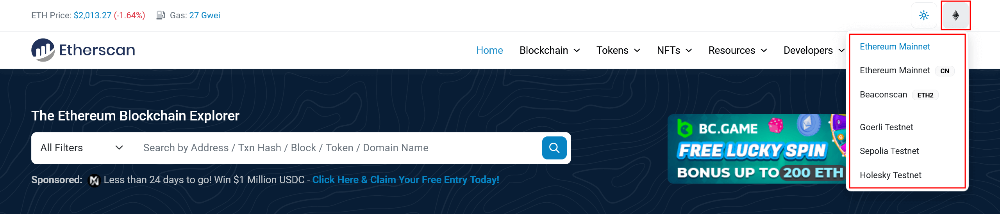
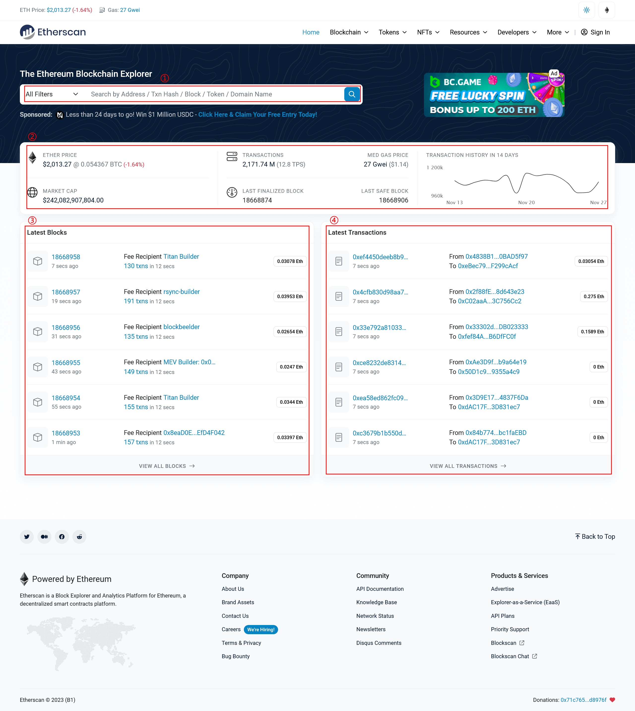
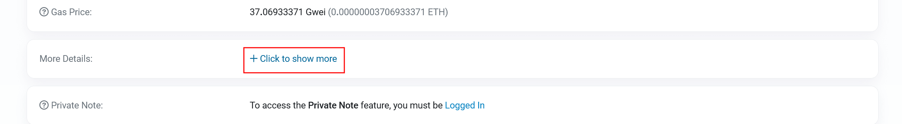
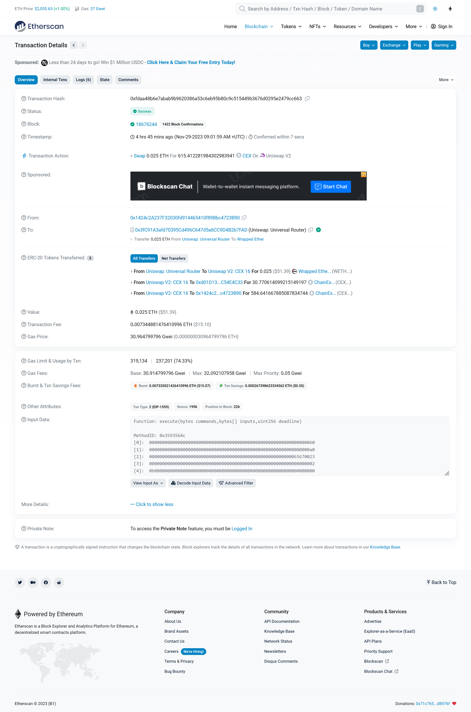
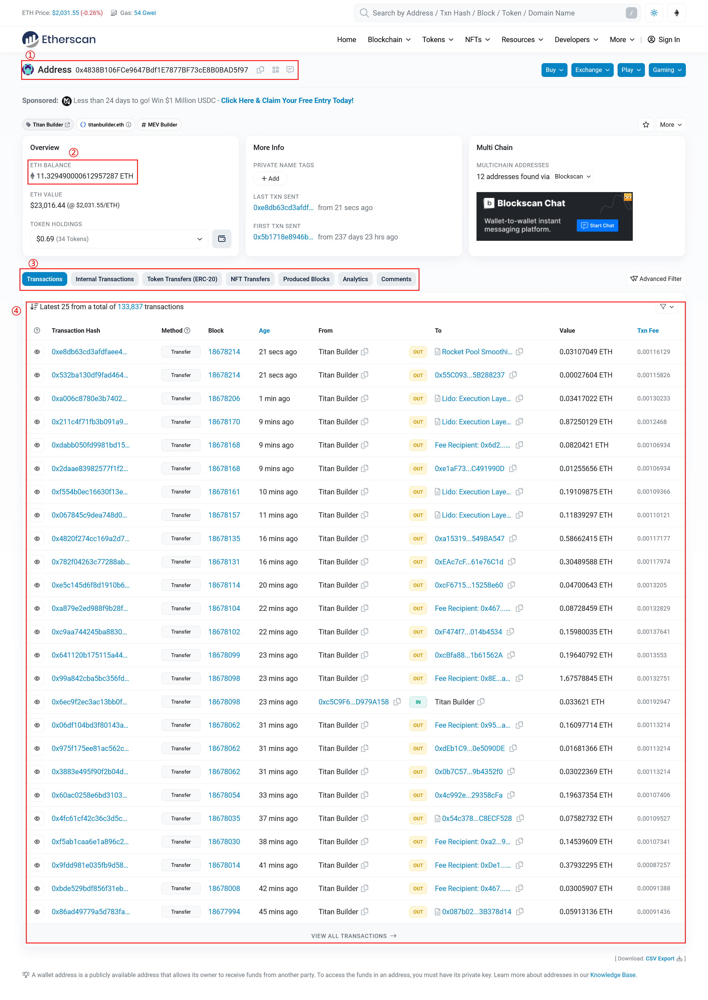
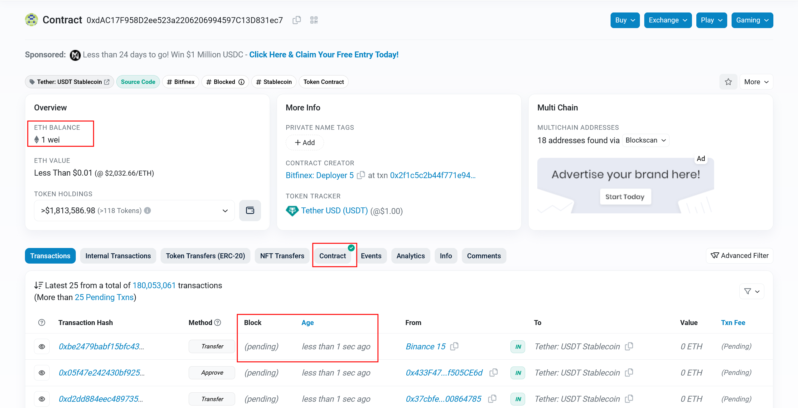
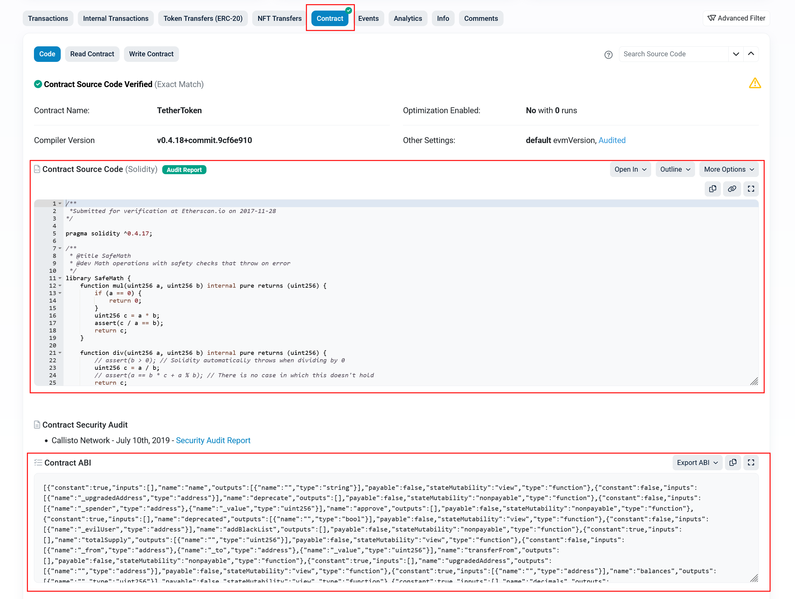

# 第一讲 进入区块链世界

自中本聪发布《比特币：一种点对点的电子现金系统》一文以来，从“比特币”到“以太坊”，再到纷繁的区块链应用，“区块链”这一技术已高速发展和变化。现在，区块链技术已经超越了其最初的应用领域，逐渐渗透到金融、医疗、物流等众多行业中。

区块链（Blockchain）是一个共享的、不可篡改的账本，旨在促进业务网络中的交易记录和资产跟踪流程。区块链从实现上来说，就是一个又一个区块（Block）组成的链条。每一个区块中保存了一定的信息，它们按照各自产生的时间顺序连接而成，形成一个链条。这个链条被保存在所有的服务器中，这些服务器在区块链系统中被称为节点，为整个区块链系统提供存储空间和算力支持，这些节点组成的分布式网络即为“区块链网络”。若要修改区块链中的信息，必须征得半数以上节点的同意并修改所有节点中的信息，而这些节点通常掌握在不同的主体手中，因此篡改区块链中的信息理论上是一件极其困难的事。

区块链根据其读写权限和中心化程度可大致分为三种：完全去中心化的，人人可参与的“公链”；多个机构组成利益相关的联盟共同维护的，半公开的“联盟链”；写入权限仅掌握在一个组织手里，所有参与到这个区块链中的节点都会被严格控制的私链。公链的交易速度相对较慢，联盟链居中，私链相对较快；但公链的隐私保护较弱，联盟链居中，私链较强。这些差异使得不同类型的区块链适用于不同的场景和需求。

在众多公链中，以太坊具有支持智能合约功能，拥有良好的互通性，交易效率高，社区支持和开发者生态良好等优点，因此，我们在接下来的课程中将以以太坊为例展开。

区块链浏览器是一种搜索引擎或在线工具，它允许用户搜索、查看并与存储在区块链上的数据进行互动。这些浏览器提供了一个用户友好的界面，用于访问和分析特定区块链网络的交易数据、地址和其他相关信息。区块链浏览器是一个重要的区块链观察窗口，接下来我们将详细介绍。

在 etherscan.io 首页左上角可以切换以太坊的不同链（区块链网络）。**本节内容以以太坊主网为主，其他章节如不另行说明，以 Sepolia 测试网络为主。**

这里以 etherscan.io 上的以太坊主网的区块链浏览器为例，当我们访问首页时（见上图），可以看到该首页提供了几个基本的功能：检索信息（①）、区块链信息概况（②）、最近区块（③）、最近交易（④）等。

区块链存在两种形式的账户，一种是合约账户，另一种是外部拥有账户，他们是包含地址、余额、随机数以及可选存储和代码的对象。一般来说，我们会在账户创建时为其分配一个与其他账户不相同的 hash 值，该值即为该账户的地址（Address）。钱包（Wallet）是一种拥有你的所有密钥但不实际存储资产的软件，它一般是方便访问和控制以太坊账户并与智能合约交互的界面。我们通常会使用钱包工具创建一个“外部拥有账户”（EOA，externally owned account，也被称为“原始账户”），我们如果需要在区块链上写数据，需要使用“原始账户”签名并提交到链上，每一次被称为一次“交易”（Transaction），区块链也会为该交易分配一个被成为“交易 hash”的 hash。

每若干个交易会根据特定的规则写入一个区块中，区块会依次连接，每一个区块创建时会自动分配一个依次加 1 的编号，这个编号被称为“区块高度”。整个区块链中生成的第一个区块的区块高度是 0，该区块也被称为“创世区块”。

我们可以利用地址、交易 hash、区块高度等信息在浏览器首页的搜索框（①）内检索对应账户（合约）、交易及区块等的信息。在搜索框的下方（②），我们可以查看包括但不限于当前区块链上的交易总量、GAS 价格中位数、最后一个确定区块、最后一个安全区块等信息。

相对其他账本技术，区块链每完成一次交易记录将消耗大量计算资源，区块链系统会评估完成一次交易记录所消耗的计算工作量，并以 GAS 这一单位来衡量。每条区块链几乎都有自带的数字资产系统，通常以代币的形式存在，每次在区块链提交交易记录时，需要根据计算工作量和 GAS 价格（每计算工作量单位需支付的数字资产，可在交易时自行设置）支付一笔数字资产。GAS 价格存在众多影响因素，这里不做展开，GAS 价格中位数可以帮助用户了解当前网络拥堵情况和交易打包速度，从而合理设置交易的燃气价格。每条链的数字资产系统可以存在多种代币，但在该链上可以用来进行 GAS 费用支付的只有一种，一般把这种代币称呼为“原生（代）币”，它伴随区块链的产生而产生，无需另外部署，以太坊的原生币是“以太（币）”。

**需要特别指出的是：在中华人民共和国，区块链上的可转移数字资产（包括但不限于代币）与法币的直接或间接交换是违法行为，任何违反相关规定的行为都可能面临法律风险，请遵守相关法律法规，避免参与任何非法活动。**

在 etherscan.io 首页，我们可以通过在检索区域指定特定的区块高度或在最近区块点击区块高度链接进入区块详情页，关于区块详情页相关内容这里不展开;同样的，我们可以在检索区域指定特定的交易 hash 或者在最近的交易点击 hash 链接进入交易详情页，接下来我们将针对部分数据项进行讲解。

请点击“Click to show more”以展开更多信息。

- Transaction Hash：交易 hash，前文已有介绍，不再赘述。

- Status：该交易的状态，当状态为“Success”时，说明交易已成功。

- Block：记录该交易的区块高度。

- Timestamp：该交易的时间。

- From：交易发送者的地址，该地址将签署交易。因为合约帐户不能发送交易，所以这将是一个外部帐户。

- To：接收地址。可以是外部帐户或合约帐户。

- Value：本次交易中发送者向接收者转移的代币数量。

- Transaction Fee：本次交易中花费的 Token。

- Gas Price：每单位 Gas 的 Token 值。

- Input Data：可包括任意数据的可选字段，一般为合约参数，但经过特殊处理，一般不能直接通过浏览器看到原始值。

如果我们点击进入任意一个地址，该链接将跳转至账户详情页，在该页面,我们会比较关注该账户的的地址（①）、代币余额（在以太坊代币即为 ETH，②）、交易列表（④）。交易列表中 Age 是指交易发生时间距离页面获取数据的时间，通常，在刚刷新页面后我们认为该时间是交易发生距离现在的时间。在交易列表的上面有一些列 Tab，方便我们筛选查看对应类型的交易。

有可能在我们打开的页面中 Tab 中会看到“Contract”，这说明我们此时打开的页面是合约账户的页面（在后文中不加特殊说明，“合约地址”指代合约账户的地址）；反之是外部账户的页面。需要指出的是，因为合约交易量巨大，可能会导致我们获取数据距离交易发生时间太短，以致未完成交易，所以在查看交易列表时会出现区块未确定（状态为“pending”）的情况，但页面渲染和大脑反应时间足够交易完成，所以我们可以点击该条的交易 hash 查看交易详情。

前面我们反复提过“合约”，这里对合约稍加说明。以太坊是第一个在区块链领域引入“智能合约”（Smart Contract，如果不做特殊说明，后面“合约”即指“智能合约”）的项目，我们可以将一个区块链理解成一个操作系统，智能合约即是部署在上面的程序，如果需要执行某一程序，则通过以太坊提供的接口来调用。

当我们点击“Contract”时，会显示合约的详细信息，“Contract Source Code”是合约的源码；“Contract ABI”是合约的 ABI，ABI 说明了合约的接口，在后面我们需要调用合约时会有重要的作用，不是所有的合约都能直接在区块链浏览器找到，我们需要通过其他途径获取。

至此，我们通过区块链浏览器的介绍梳理了一些区块链领域的重要概念，后面我们将介绍如何通过钱包和区块链进行交互。
