# 一种广泛使用的区块链钱包——MetaMask

前面我们介绍了区块链的一些基础概念，接下里，我们将介绍在区块链应用中需要广泛使用的一种工具——区块链钱包，并且介绍在以太坊生态下使用最广泛的一种钱包——MeteMask。

## 区块链钱包简介

我们通常理解的钱包，需要在钱包中存放钱，但在区块链世界中钱包更多的是一个密钥管理工具和账户信息查看工具，所有的“钱”的数据都存放在区块链上。钱包中存放的密钥，有足够的权限控制区块链账户（包含验证身份和处理资产），所以，我们可以使用钱包登录应用、查看账户信息、发送交易、验证身份。

钱包大多数情况下可以生成多个公私钥对，公钥是一串可以用来与其他用户共享的字符，用于接受数字货币，就像银行账户；私钥是一串必须严格保密的字符，主要用于签名交易和身份验证，就像银行卡密码。公钥可以计算得出账户地址，一个公私钥对对应一个区块链账户，因此大多数情况钱包可以同时管理多个区块链账户。

需要特别注意的是保护私钥是区块链钱包用户的最重要任务之一，因为私钥是控制区块链上资金的关键，如果不幸私钥泄露，钱包上的资产可能被窃取、财务状况可能被未授权的第三方获取。

大多数情况下我们也可以在支持相同生态的钱包供应商之间切换。

钱包的主要类型有，桌面钱包（安装在电脑上的软件）、移动钱包（安装在手机上的应用程序）、硬件钱包（物理设备）和纸质钱包（将密钥写在纸张上）等。

以太坊提供了 [一个可供参考的支持以太坊生态的钱包列表](https://ethereum.org/zh/wallets/find-wallet/) 钱包在以太坊生态下应用比较广泛，我们接下来的课程将使用它来进行学习。

## MetaMask 简介

MetaMask 是用于与以太坊区块链进行交互的软件加密货币钱包，因为它的 Logo 是一只小狐狸，所以又被称为“小狐狸”。它可以通过浏览器扩展程序或移动应用程序让用户访问其以太坊钱包，与去中心化应用进行交互。

### 安装 MetaMask

这里我们介绍如何安装 MetaMask 浏览器拓展程序，可以直接访问 MetaMask 的 [下载页面](https://metamask.io/download/) 或通过 [MetaMask 官方网站](https://metamask.io/) 的页脚的 `Download` 链接进入下载页面（如下图中的 ①）。

MetaMask 下载页会自动识别访问该页面的浏览器，可以点击 `Install MetaMask for XXXXX` 按钮（下图 ② 处），安装浏览器插件，如果识别失败或者错误，可以在 Supported Browsers 区域（下图 ③ 处）选择合适的浏览器，点击对应的图标，和上面的按钮点击效果一样进入对应浏览器的拓展程序应用市场的 MetaMask 插件详情页，可以直接安装该插件。

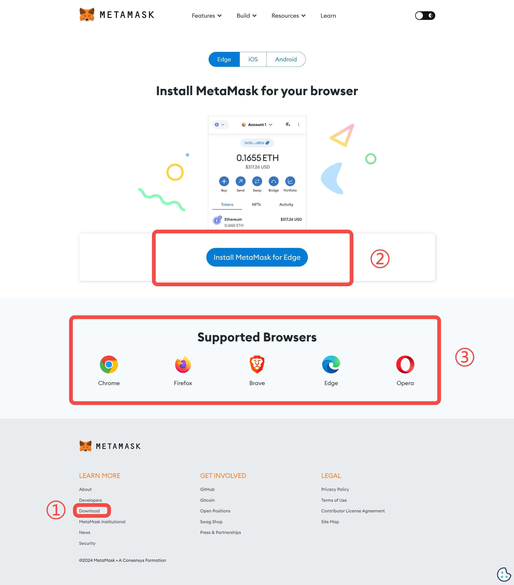

### 创建 MetaMask 钱包

在安装 MetaMask 插件后，MetaMask 会自动弹出创建钱包的引导页面，如果将这个页面关闭，在没有创建钱包或者导入现有钱包的情况下点击浏览器插件可以再次弹出该引导页。该页面可以选择显示的语言（如下图 ①），在下图 ② 处勾选“我同意 MetaMask 的使用条款”复选框，可以选择“创建新钱包”或者“导入现有钱包”，我们这里选择点击“创建新钱包”。

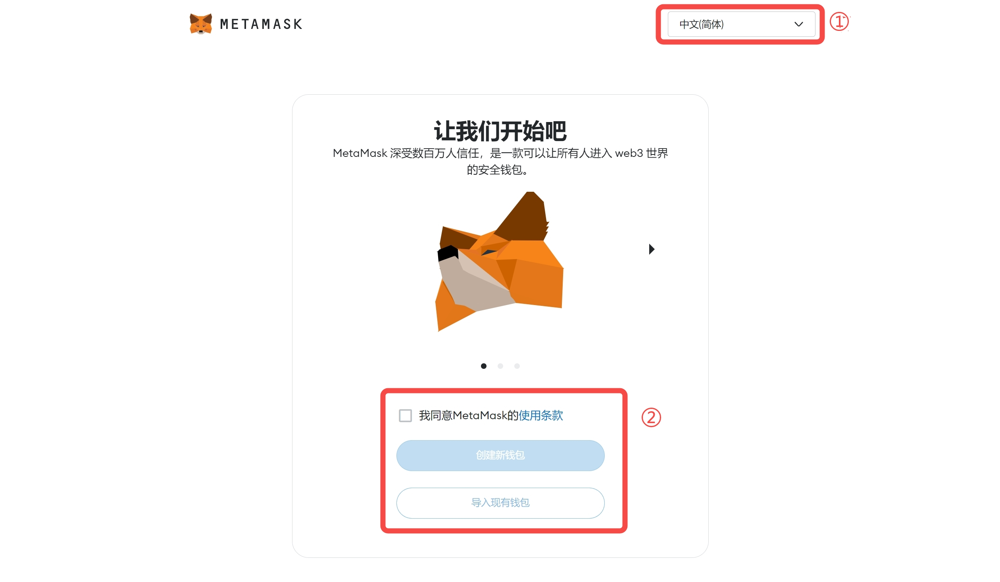

请认真阅读相关说明，我们可以根据实际情况选择是否帮助改进 MetaMask，建议同意。

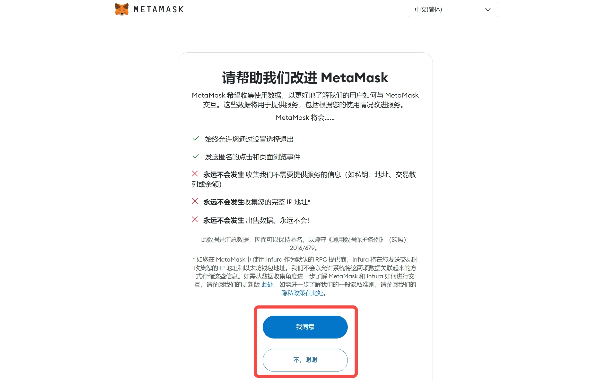

需要填写新密码和确认密码，该密码用于每次登录钱包，勾选复选框“我明白 MetaMask 无法为我恢复此密码。”，需要注意该密码一旦忘记无法找回，点击“创建新钱包”。

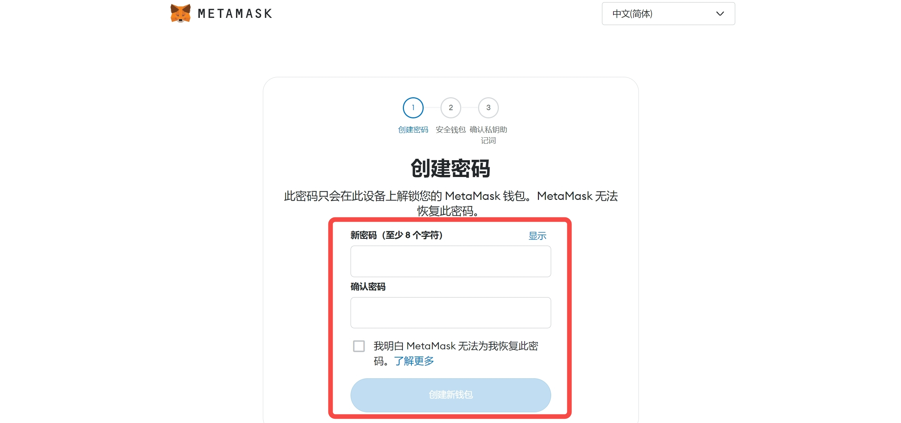

请认真阅读页面中有关助记词的说明，并建议选择“保护我的钱包（推荐）”。

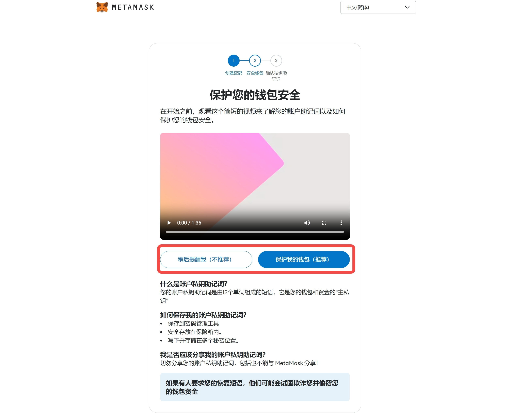

这一步 MetaMask 将显示钱包的私钥，点击“显示私钥助记词”，并且确保密码不被泄露，可以将这些助记词抄写在纸上，存放在保险柜中，确保助记词既不丢失也不泄露。

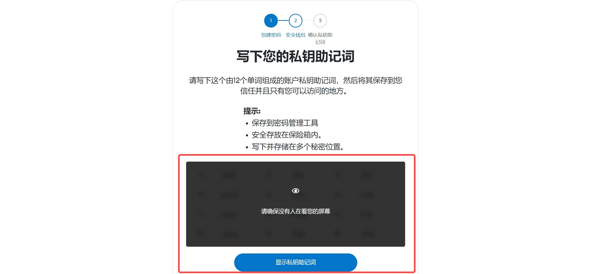

将助记词记录后，点击“下一步”按钮。

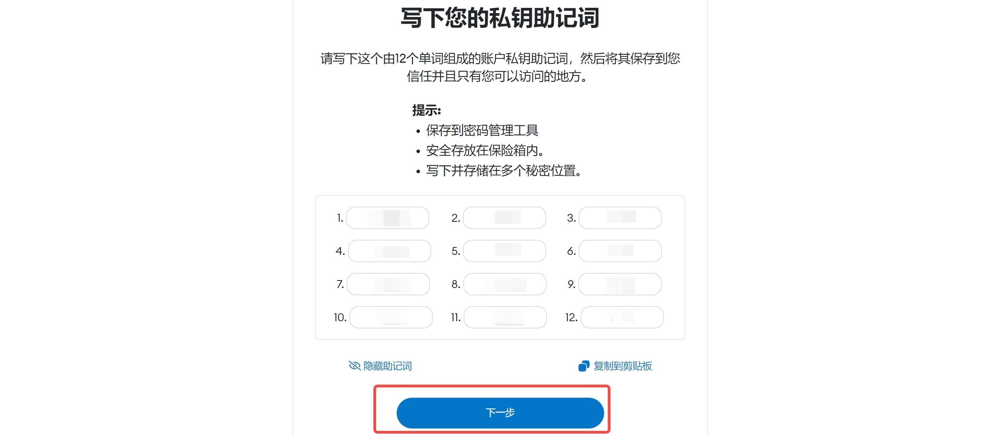

在缺失的位置填写助记词，并点击“确认”按钮。

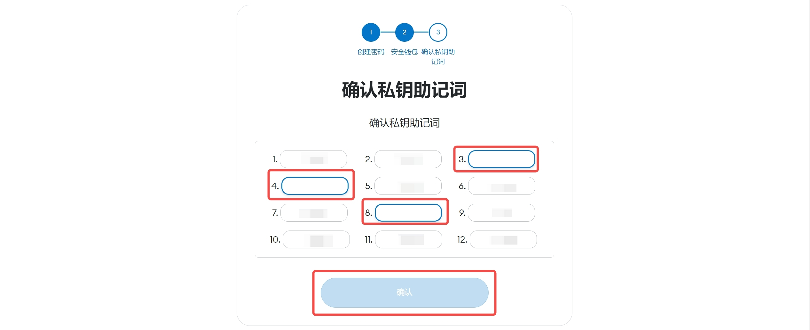

到这一步，钱包已经创建成功了，点击“知道了！”按钮继续。

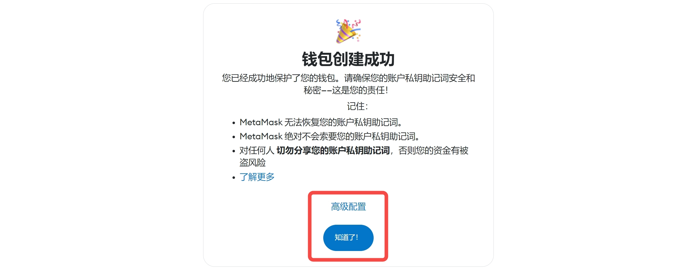

MetaMask 提示我们对插件固定到浏览器配置，推荐按提示进行固定，点击“下一步”按钮。

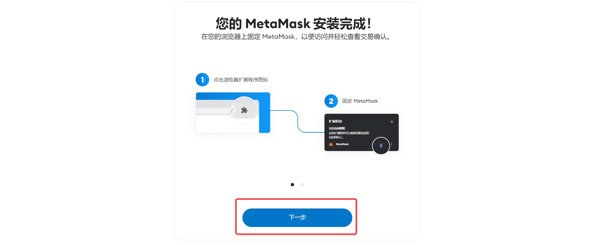

点击“完成”按钮。

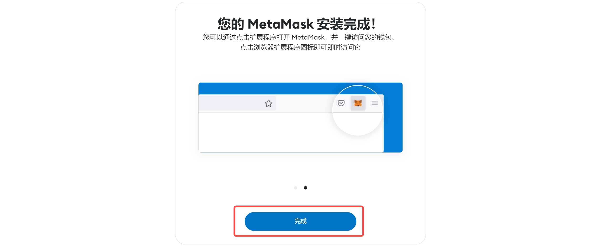

页面跳转到插件首页，页面显示最近更新的内容，查看后关闭即可。

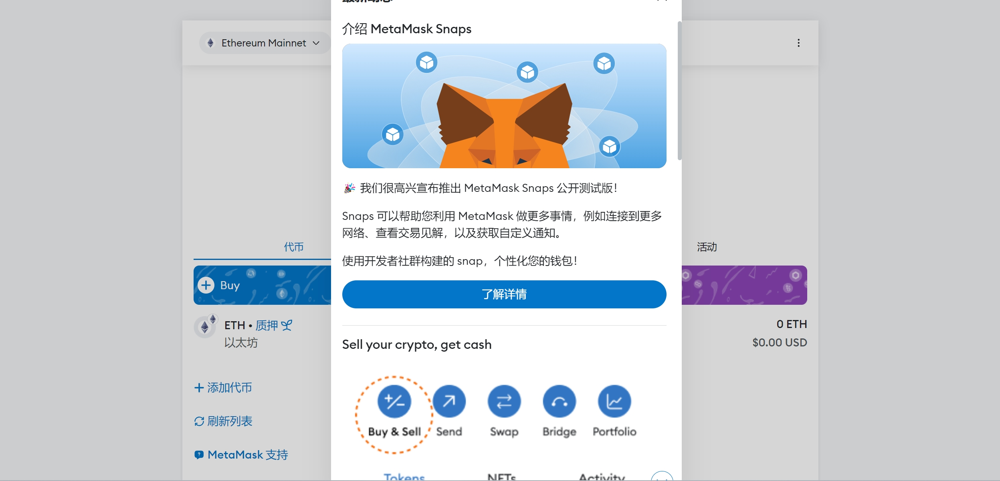

### MetaMask 常用功能介绍

接下来介绍一些 MetaMask 的常用功能。我们可以可以点击 MetaMask 插件（如下图 ① 处），MetaMask 可以显示插件首页，点击更多选项（如下图 ② 处），会显示更多选项（如下图 ③ 处），其中下面将介绍账户详情、在 Explorer 上查看、已连接的网站、展开视图、锁定 MetaMask 等功能，在更多选项按钮的左侧有一个连接账户管理的按钮（如下图 ④ 处，网站和钱包管理的账户连接后，可以调取钱包提供的接口，实现发起交易和交易签名等功能，这和非区块链应用中的“登录”类似），该功能在展开视图没有，我们先介绍该功能。

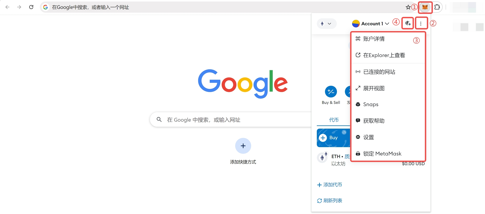

#### 网站连接账户管理

当我们访问一个网站时，点开 MetaMask 界面，点击连接账户管理的按钮（如下图 ① 处，如果图标右下角是灰色圆形，表示该钱包管理的账户没有账户连接该网站；如果图标右下角是绿色圆环，表示有该钱包管理的账户连接该网站，但当前的账户没有连接；如果图标是绿色圆形，表示当前账户已连接该网站）将显示连接账户管理界面，如果没有钱包管理的账户连接当前网站，则只会提示“MetaMask 没有连接到该网站。要连接到 web3 网站，请找到并点击连接按钮。”。

连接账户管理界面中我们可以看到当前网站的域名（如下图 ② 处）、该钱包管理的账户中连接当前网站的账户数（如下图 ③ 处）、该钱包管理的账户中连接当前网站的账户列表（如下图 ④ 处）、展开权限可以查看已授权的权限（如下图 ⑤ 处）。如果当前钱包有账户连接该网站，但当前账户没有连接，账户列表（如下图 ④ 处）还会展示当前账户的信息，这些账户信息一般包含账户头像、账户名称、账户地址、连接状态（网站上的操作关联的账户会显示“活跃”，当前账户没有连接该网站显示“未连接”）、“连接”（当前账户没有连接该网站显示该按钮，点击可以快速连接该网站）或“切换到该账户”（连接该网站但非“活跃”账户会显示该按钮，可以快速切换活跃账户）按钮，每一个已连接的网站右侧有一个更多菜单，点击会显示“断开此账户的连接”按钮，点击后可以断开该账户的连接。

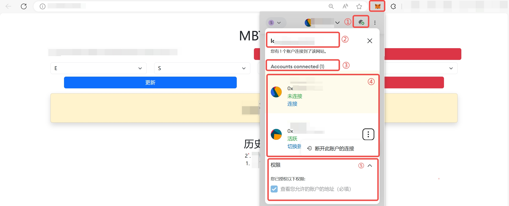 

#### 在 Explorer 上查看账户和展开视图

点击“在 Explorer 上查看账户”（如下图 ① 处）可以访问当前网络设置的区块链浏览器的当前账户的主页，查看相关信息。“展开视图”功能（如下图 ② 处）可以通过浏览器页面的形式访问 MetaMask，这两种访问形式 UI 类似，但通过网页形式访问会丢失部分功能如前面介绍的“网站连接账户管理”。

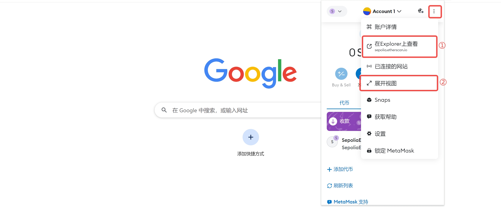

#### MetaMask 账户详情

更多菜单的“账户详情”，点击后会弹出弹框，显示账户名、账户二维码、账户地址和“显示私钥”按钮。账户名右侧的修改按钮点击后可以修改账户名，账户名主要用于标注账户，方便区分；账户地址右侧的复制按钮可以方便复制地址；点击“显示私钥”按钮可以显示私钥，这对后端开发区块链应用非常有用，如果需要迁移钱包供应商也需要通过导出私钥来完成迁移工作。

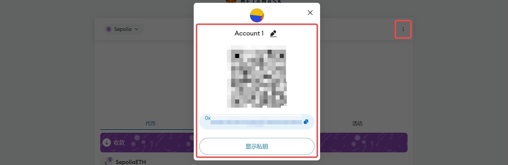

点击“显示私钥”按钮，将跳转到输入密码页面，需要输入登录钱包的密码，点击“确认”按钮。

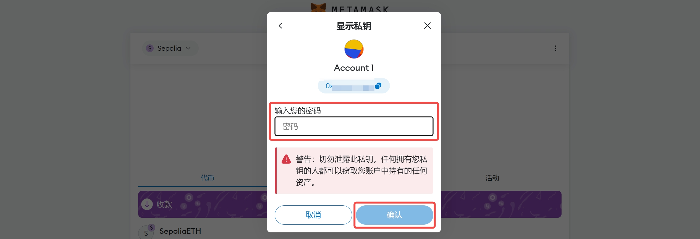

长按“按住以显示私钥”按钮。

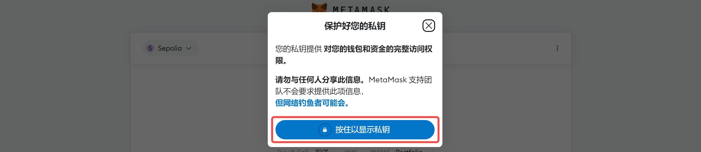

页面将显示私钥，右侧的复制按钮可以快速复制私钥，点击“完成”按钮将关闭页面。

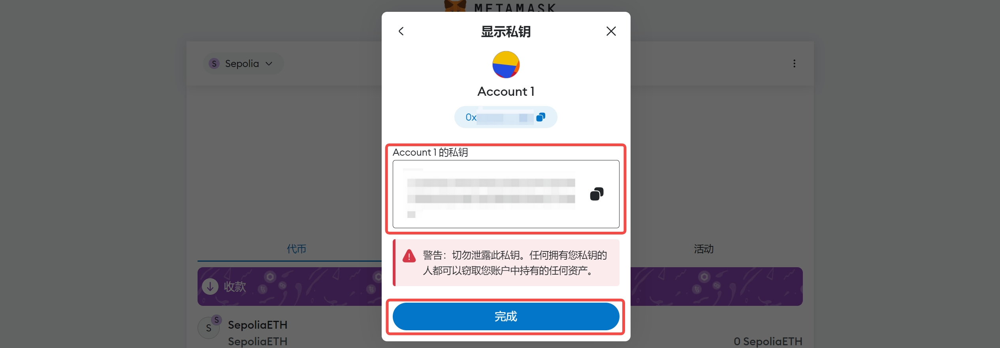

#### 账户已连接的网站管理

点击更多菜单的“已连接的网站”，显示已连接网站的列表，可以在这里快速断开和某一个网站的连接。

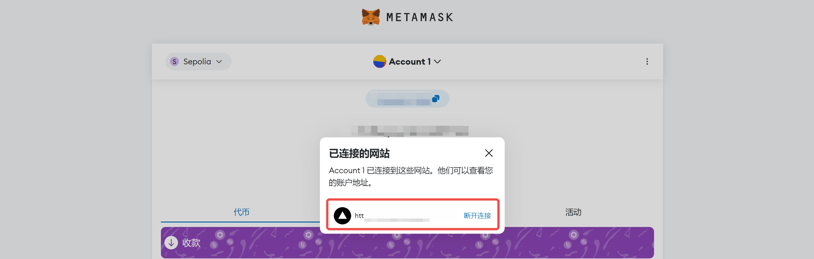

#### 退出 MetaMask 和登录 MetaMask

点击更多菜单的“锁定 MetaMask”，钱包退出登录状态（如下图），这个状态在关闭浏览器后打开也会出现。在该界面可以切换网络（如下图 ① 处），填写密码后点击“登录”按钮（如下图 ② 处），可以登录钱包。

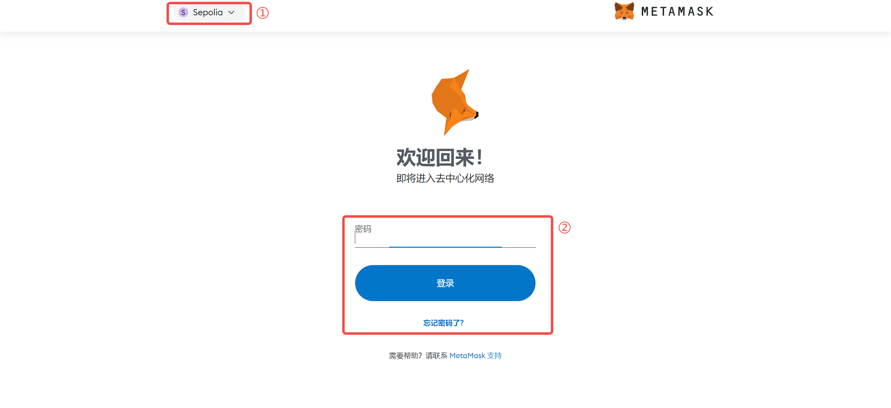

#### MetaMask 网络切换和添加

在登录状态下，左上角也有可以切换网络的按钮（如下图），点击弹出切换网络界面。

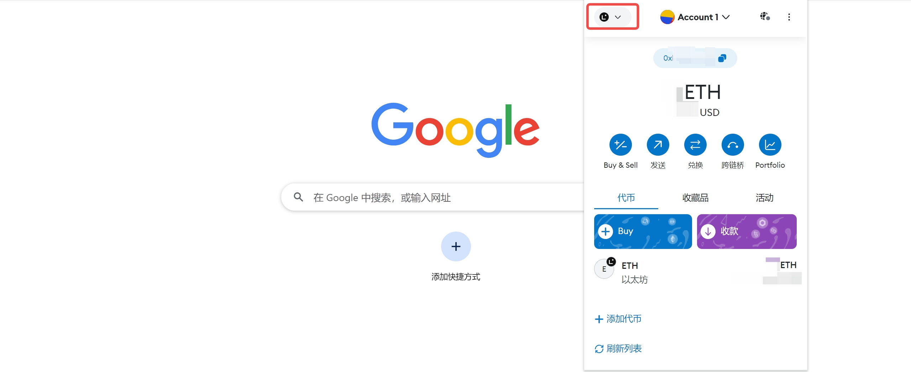

切换网络界面默认展示所有默认添加的正式网络和自行添加的网络（如下图 ① 处）；如果打开“显示测试网络”开关（如下图 ② 处），可以展示 MetaMask 默认添加的测试网络（如下图 ③ 处）；点击“添加网络”按钮（如下图 ④ 处），可以跳转添加流行或自定义网络页面。

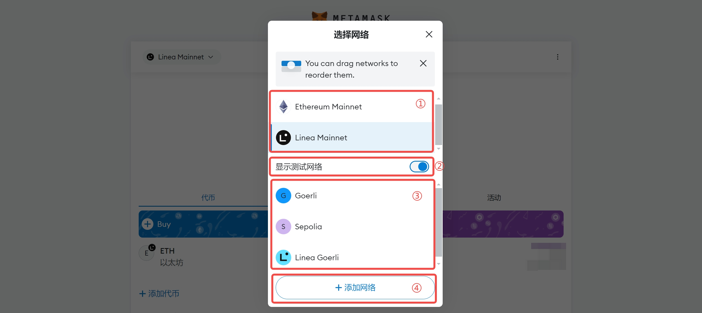

流行或自定义网络页面可以添加 MetaMask 默认配置好的比较流行的网络（如下图 ① 处），点击对应网络的“添加”按钮就可将该网络添加到 MetaMask。如果没有想要添加的网络，可以点击“手动添加网络”链接（如下图 ② 处），可以跳转到添加自定义网络页面。

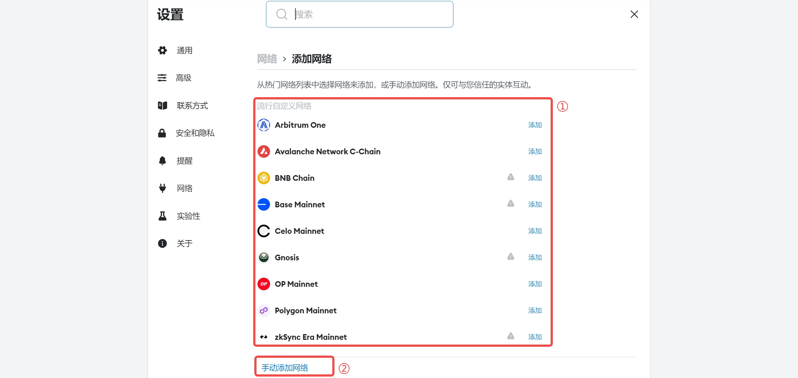

在添加网络页面，我们填写网络的名称、RPC URL、链 ID、货币符号、区块链浏览器 URL（可选），点击“保存”即可添加网络。如果我们要添加网络，一定要确定这些信息的有效性和安全性，尤其是 RPC URL 和区块链浏览器 URL，如果误将钓鱼链接填写到这里有可能带来经济损失，所以我们尽量使用该网络项目官方提供的服务或者业界比较靠谱的服务。

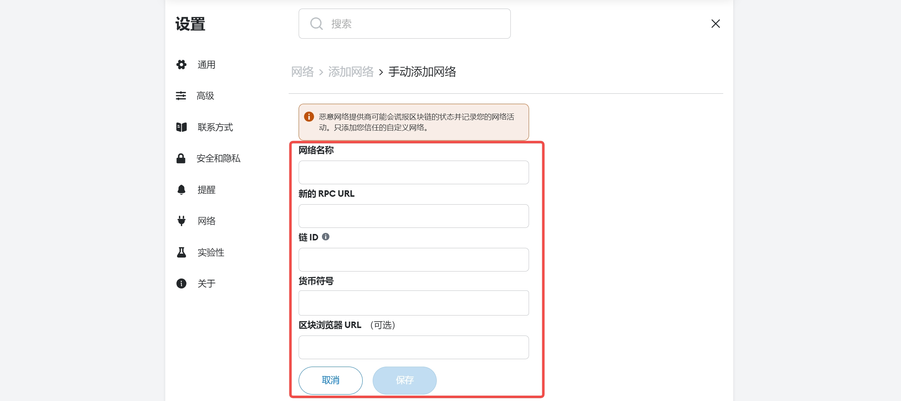

这里我们也可以通过一些开源项目来进行网络添加，比如 https://chainlist.org/ 和 https://chainlist.wtf/ ，这些网络的信息来自于社区贡献，也需要注意甄别安全性。

这里以 chainlist.org 为例介绍一下如何使用这类网站进行网络添加。当我们访问网站，因为收录的网络较多，可以在搜索栏（如下图 ① 处），可以输入网络名进行过滤；如果勾选“Include Testnets”复选框（如下图 ② 处），下面的网络列表（如下图 ④ 处）会显示测试网，每个网络信息以卡片信息展示，每个卡片上显示每个网络的网络名、ChainID 以及代币的单位符号，点击卡片下的折叠面板控制按钮，可以获得该网络的 RPC 服务的网络状态（如下图 ⑤ 处）。要添加网络，需要钱包连接该网站，点击“Connet Wallet”按钮（如下图 ③ 处）。

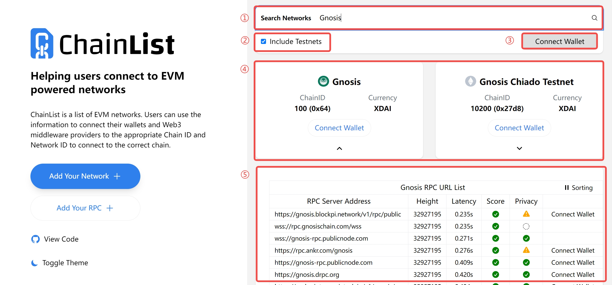

当我们在网站上请求连接钱包时，MetaMask 会弹出选择账户界面，该界面会显示连接网站的域名（如下图 ① 处），可以从当前钱包管理的所有账户中勾选需要连接的账户（如下图 ③ 处），也可以点击“新用户”按钮（如下图 ② 处）新建一个账户连接网站，选择好账户后点击“下一步”按钮（如下图 ④ 处）。

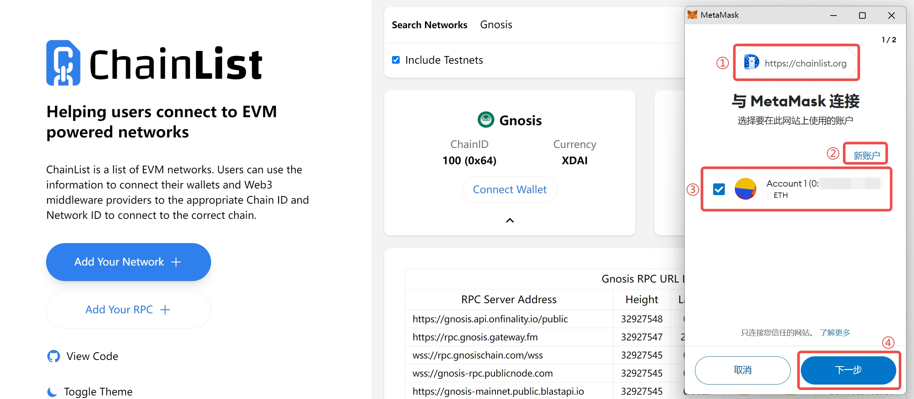

确认连接钱包及授权，点击“连接”，将钱包连接到恶意网站会带来风险，需要注意网站的安全性。

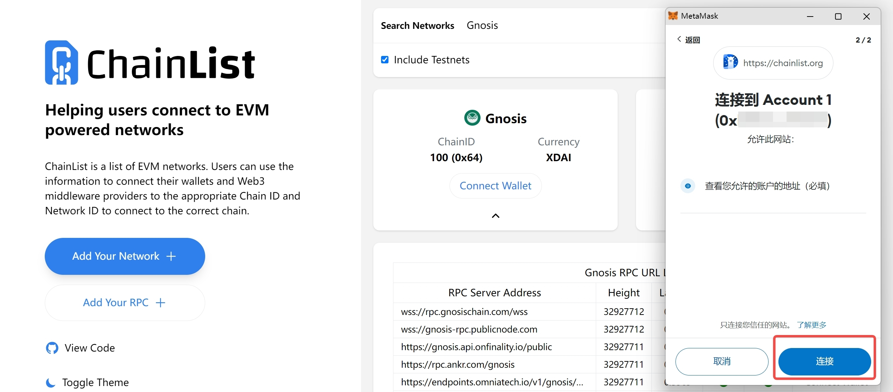

连接网站后，点击想要连接的网络的卡片上的“Add to MetaMask”按钮，MetaMask 就会弹出连接网站的提示。

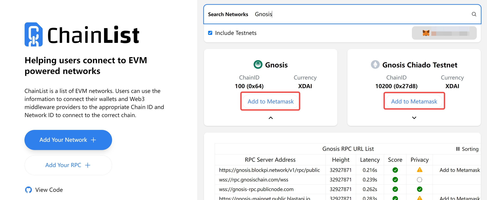

点击“查看所有详情”按钮（如下图 ① 处），可以查看网络的详情信息，注意这些信息的安全性，如确认无误，可以点击“批准”按钮（如下图 ② 处）。

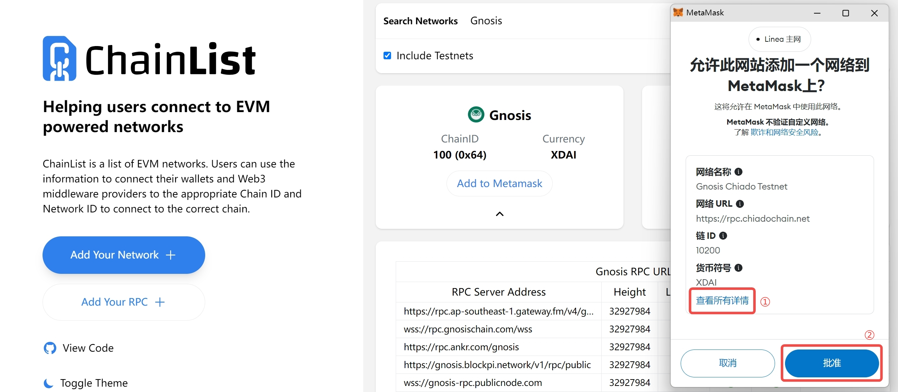

MetaMask 会自动弹出切换到新网络的确认请求，可以根据需要点击“切换网络”按钮或“取消”按钮。

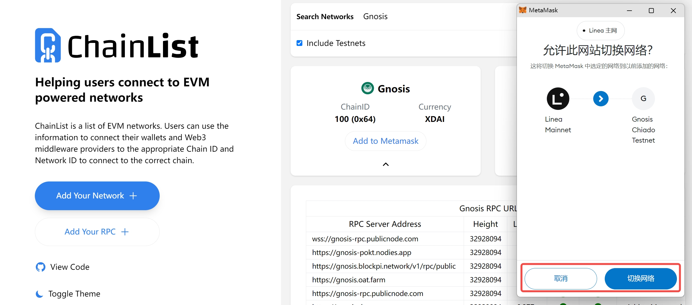

我们可以通过更多菜单的“设置”来进行网络管理，点击“设置”按钮进入设置页面。

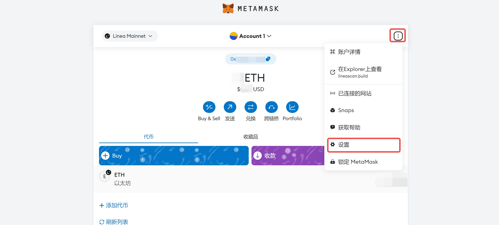

在设置页的左侧菜单栏点击“网络”（如下图 ③ 处），可进入网络设置页面，可以在当前钱包已添加的网络列表（如下图 ④ 处）选择需要修改的网络，在右侧表单（如下图 ⑤ 处）修改网络信息或者删除网络，注意在网络列表中带锁标记的网络既无法修改也无法删除，当前钱包连接的网络也无法修改和删除，可以使用左上角的网络按钮切换网络（如下图 ① 处），在该页面也可以点击“添加网路”按钮（如下图 ② 处），添加网络。

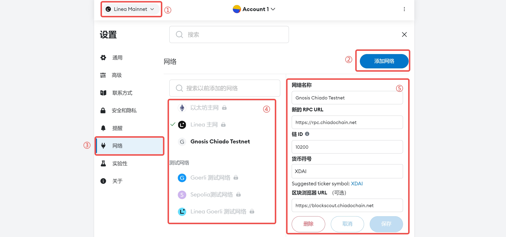

#### MetaMask 主页页面介绍

前面的介绍涉及到主页的部分功能，接下来简单介绍一下主页其他的部分。顶部中间那是当前账户名称（如下图 ① 处），点击可以切换账户，具体操作后面会详细系介绍；下面依次是账户地址（如下图 ② 处，点击地址右侧的复制按钮可以快速复制账户地址），原生代币余额和该余额对应的美元价值（如下图 ③ 处），常用操作（如下图 ④ 处，后面会详细介绍“发送”功能），代币、收藏品和活动的切换 Tab（如下图 ⑤ 处，后面“发送”功能会顺带介绍“活动”）。

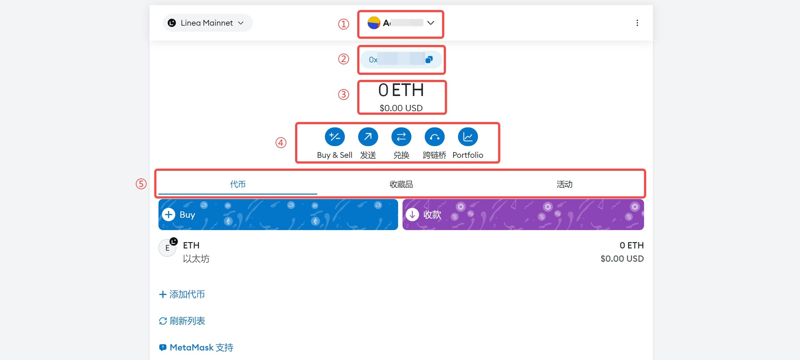

#### 切换账户和添加账户

点击当前账户名称，会弹出“选择一个账户”提示弹框，该弹框会显示钱包管理的所有账户，可以点击希望切换的账户切换当前账户。如果希望添加账户，可以点击“Add account or hardware wallet”按钮，会弹出添加账户的弹框。

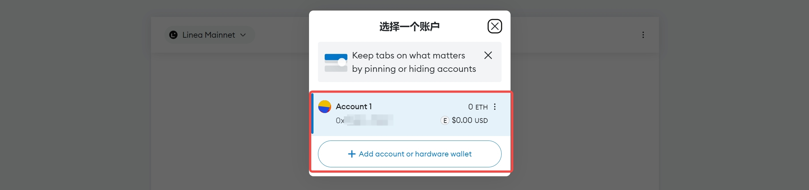

添加账户的弹框中有三种添加账户的方案，分别是“Add a new account”（直接在 MetaMask 添加账户）、“导入账户”（使用私钥导入账户）和“添加硬件钱包”。

这里介绍一下在 MetaMask 添加新账户，点击“Add a new account”选项，弹出填写账户名称弹框，填写账户名称（账户名称主要用于本钱包区分账户，不与其他钱包共享），并点击“创建”按钮，即可创建新账户。

#### 发送代币

点击首页的“发送”按钮，可以发送当前选择的网络的原生代币到指定账户。

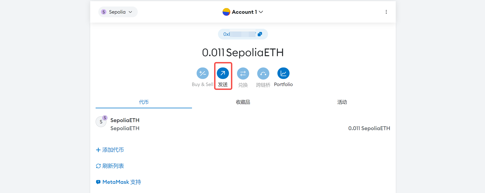

选择接受代币的账户，可以填写账户地址（如下图 ① 处）并回车，也可以选择账户（如下图 2 处）。

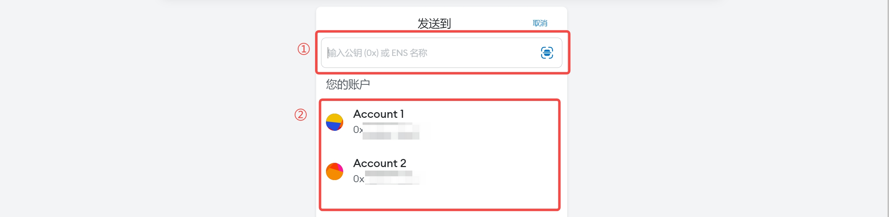

在发送信息页展示了接受代币的账户（如下图 ① 处点击右侧的删除按钮可以回退到上一步选择接受者）、当前账户的余额（如下图 ② 处）、发送的代币数（如下图 ④ 处，点击左侧的“最大”按钮，如下图 ③ 处，可以将发送代币数设置为可转移的最大数值）和当前的费率（如下图 ⑤ 处），设置完成后点击“下一步”按钮。关于“最大”按钮，这里需要说明，由于在区块链上每一笔交易都需要支付 GAS 费，并且 GAS 费会根据实际情况浮动，如果将账户上的余额全部转移出去，会导致无法支付 GAS 费而交易失败，所以如何将账户的余额尽可能多的转移到指定账户，同时预留足够的余额作为 GAS 费是一个需要精准计算的问题，MetaMask 提供了 “最大” 按钮，可以简便地解决这一问题。

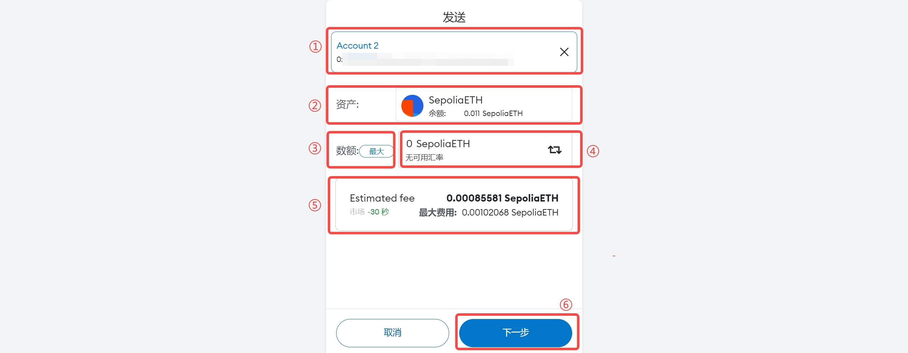

在发送 token 信息确认页面，展示了代币的发送方和接收方（如下图 ① 处）、发送的代币种类和数量（如下图 ② 处）、GAS 费的信息（如下图 ③ 处，点击“Fee details”按钮可以展示该笔交易预计支付的 GAS 费）和总支出（如下图 ④ 处，含发送金额和 GAS 费），确认信息后可根据实际情况点击“取消”或“确定”（如下图 ⑤ 处），或者点击“编辑”（如下图 ⑥ 处）返回上一步。

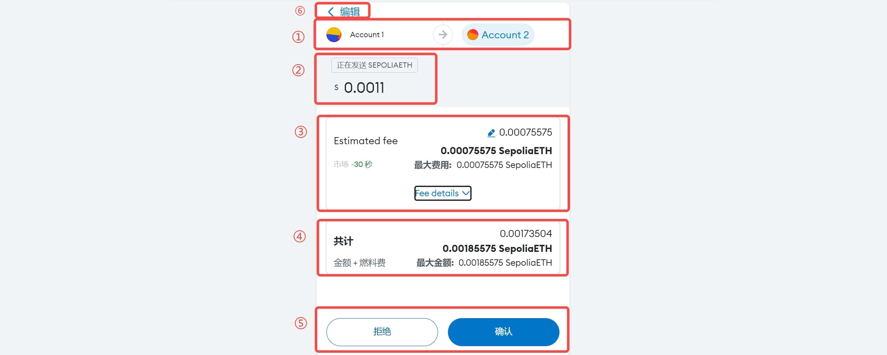

如果是 Windows11 系统，当交易被确认，MetaMask 会调用系统通知该交易已被确认（如下图）。

当交易被创建，点击首页的活动 Tab （如下图 ① 处），也可以查看交易列表（如下图 ② 处）。交易列表展示了交易时间、交易类型、交易金额等信息，点击列表中的任意一条交易，可以显示更详细的有关交易的信息。

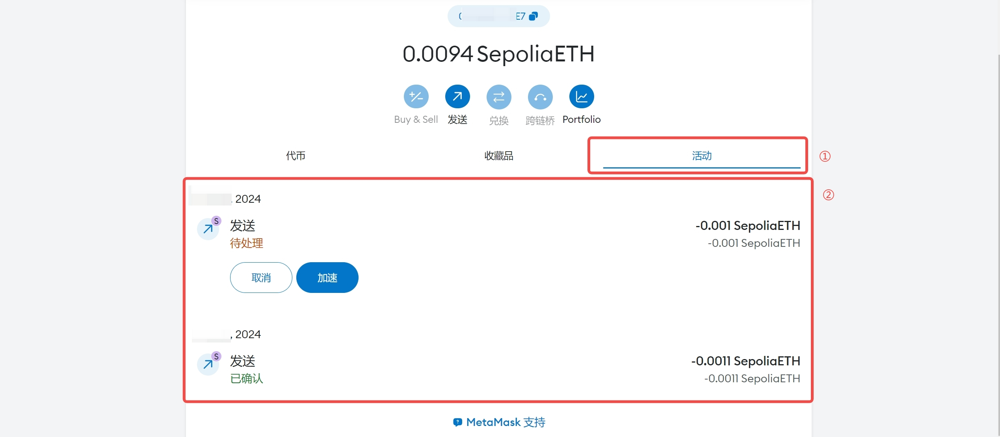

交易详情（如下图）展示了交易类型、状态、交易 ID、区块链浏览器链接、交易账户、交易金额等重要信息，点击底部的活动日志还可以查看完成该交易的时间线。

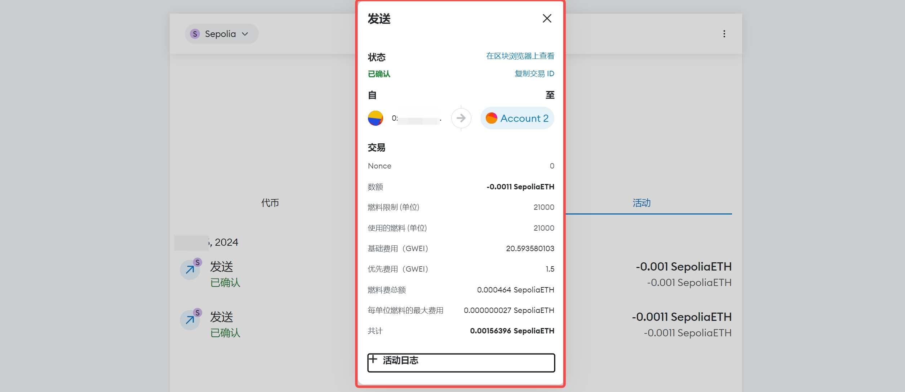

本节我们简单介绍了 MetaMask 的使用方法，感谢大家。
