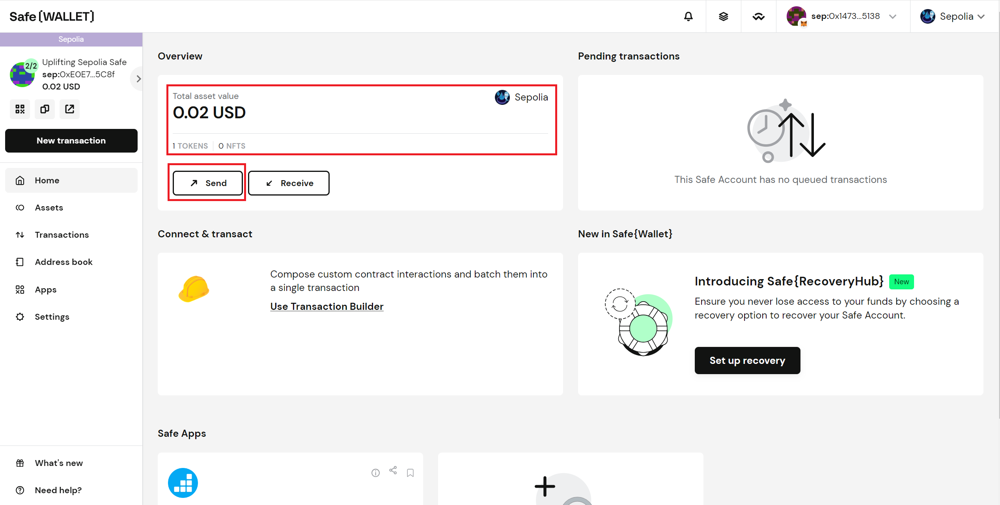

# 第六讲 相关工具/应用简介

前面的课程我们介绍过区块链浏览器、钱包等区块链应用或工具，本讲希望再给大家介绍几个区块链相关的应用或者工具，以便应对常见的应用场景。

## Safe 钱包

前面我们介绍了密钥钱包，这些账户使用 12 个单词组成的“助记词”进行保护，可以将这些助记词转换成用户私钥，如果私钥被泄露，这将导致账户面临巨大的风险。

这些钱包，进行一次签名就可以执行交易，这意味着一旦私钥泄露，可能钱包相关的资产都将被盗。另外，在一个组织内如果所有资产被一个账户掌握，也将面临巨大的风险。

为了解决上述问题，这就需要一种新的工具——多签钱包了。在多签钱包，可以设置多个账户，并且可以设置需要至少多少账户签名才能执行交易。

这里以 [Safe](https://app.safe.global/) 为例，简要介绍多签钱包的使用。Safe 由 [Gnosis](https://www.gnosis.io/) 孵化，原名 Gnosis Safe，后来独立并更名，它是 Gnosis 孵化的最成功的项目之一。Safe 是一个开源产品，同时也开放了许多 SDK 方便接入系统，在有必要情况下可以进行二次开发。

进入首页后需要链接钱包并将网络切换至 Sepolia。

如果是第一次使用请直接点击“Continue with MetaMask”按钮，创建一个多签账户。

填写 Safe 账户名字（选填，这个名字只会存在本地，用于账户区分），选择账户所在的链，点击“Next”。

默认创建者是第一个 owner，可以添加注释名，以区分账户，点击“Add new owner”可以新增 owner，多签钱包需要 owner 签名到指定 threshold 数后才可以执行指定操作，所以我们还需要指定 threshold，点击“Next”。

检查网络、owners 和 Threshold 等信息，如果无误可以选择支付 GAS 费的方式（推荐 MetaMask），点击“Next”。支付 GAS 费。

当页面提示“Your Safe Account was successfully created!”说明多签账户创建成功，点击“Start using Safe{Wallet}”，进入账户首页。

我们向合约账户转入少量的 Sepolia，用来演示如何通过多签执行转账操作。等待到账后，点击“Send”。

在这里可以选择交易类型：发送 token、发送 NFT 及调用合约，这里我们选择发送 Token，我们点击“Send tokens”。

填写接收地址、发送数量、发送的种类，点击“Next”。

检查交易信息是否正确，可以点击“Transaction details” 可以展示详情。点击“Simulate”可以模拟交易，测试填写的内容是否有误。可以点击 “Sign”，进行第一次签名。完成后进入首页，点击左侧导航栏的“Transactions”，可以看到所有交易。

我们登录另一账号，进入 Transactions 页面的 Queue 页进行签名。点击展开交易详情，点击“Confirm”，将跳转至确认交易页。

确认交易页部分功能和前面页面一致就不重复介绍了，这里我们关注一下执行部分的两个选项，一个是是否立即执行，这里我们选“是”（“Yes, execute”），该选项表示我们将签名和执行合并成了一个操作；另一个问题在询问我们的支付方式，推荐 MetaMask（“Connected wallet”）。点击“Execute”，

当页面出现“Transaction was successful”，即为交易完成。

在上面，我们模拟了两个账户多签进行转账的过程，希望能增进大家对多签的理解。

如果有多个多签账户，请点击左侧菜单栏的右拉按钮，查询账户列表。

如果在应用首页，可以点击“My Safe Accounts”参看当前登录钱包关联的多签账户。

更多关于 Safe 的内容请自行查相关阅资料或参考网站提示说明。

## The Graph

