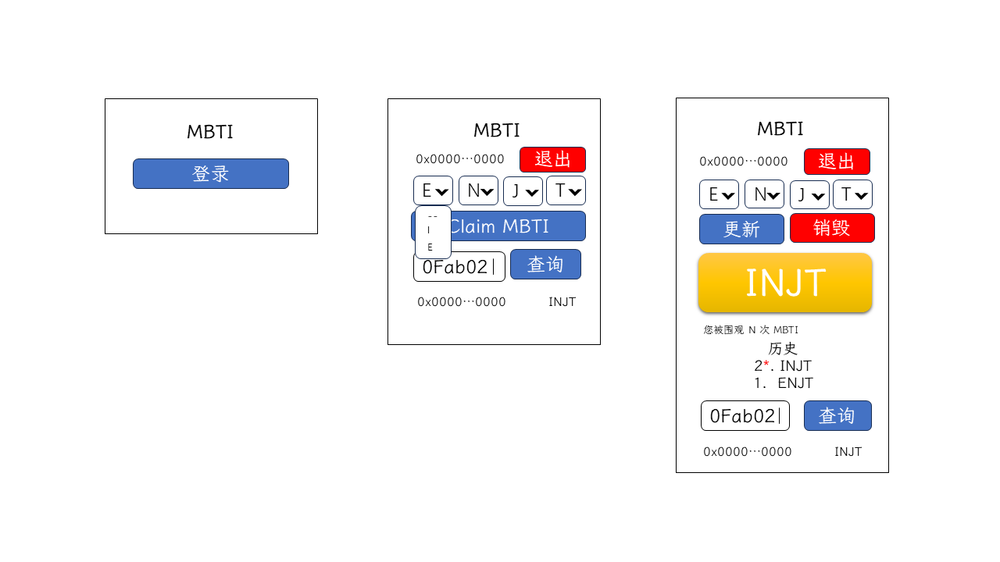

# 第七讲 需求分析和数据模型分析

前面的课程我们介绍了区块链基础知识、钱包相关操作和使用 JavaScript 和区块链进行交互，前面的课程侧重知识点和理论梳理，从这一讲开始，我们进行一个完整项目的区块链应用的前端开发，在这个项目中，我们也会介绍少量在后端环境进行区块链交互的内容，通过实战的方式将前面的知识点串联起来，从理论中来，到实践中去。

## 项目需求

MBTI（Myers-Briggs Type Indicator）是一种广泛使用的性格类型评估工具，旨在帮助人们了解他们在获取信息、作出决策以及对待生活等方面的心理活动规律和性格类型。MBTI 量表共分为四个维度：外倾 E、内倾 I；感觉 S、直觉 N；思考 T、情感 F；判断 J、知觉 P。这四个维度两两组合，可以组合成 16 种人格类型，每种类型由四个字母组成，分别表示一个人在四个不同维度上的倾向。例如，INFP 代表内倾、直觉、情感、知觉。

近年来，MBTI 越来越受到人们的关注，我们希望做一个 APP 能够在链上记录、更新和销毁本人的 MBTI，该应用也可以展示本人 MBTI 的记录，还可以查询他人的 MBTI 并展示被查询的次数（每次查询需要验证签名）。应用的线框图如下（在每一讲再详细介绍具体功能，这里就不展开）：



合约部署在 Sepolia 网络上，其地址是 `0x9f47Ea16345c09523a6A1DA1B84f5EB4E1bea221`，合约 ABI 如下：

```json
[
  {
    "inputs": [],
    "stateMutability": "nonpayable",
    "type": "constructor"
  },
  {
    "anonymous": false,
    "inputs": [
      {
        "indexed": true,
        "internalType": "address",
        "name": "user",
        "type": "address"
      },
      {
        "indexed": false,
        "internalType": "int8",
        "name": "mbtiType",
        "type": "int8"
      }
    ],
    "name": "MBTIUpdated",
    "type": "event"
  },
  {
    "inputs": [
      {
        "internalType": "int8",
        "name": "mbtiType",
        "type": "int8"
      }
    ],
    "name": "claimMBTI",
    "outputs": [],
    "stateMutability": "nonpayable",
    "type": "function"
  },
  {
    "inputs": [],
    "name": "destroyMBTI",
    "outputs": [],
    "stateMutability": "payable",
    "type": "function"
  },
  {
    "inputs": [
      {
        "internalType": "address",
        "name": "user",
        "type": "address"
      }
    ],
    "name": "getMBTI",
    "outputs": [
      {
        "internalType": "int8",
        "name": "",
        "type": "int8"
      }
    ],
    "stateMutability": "view",
    "type": "function"
  },
  {
    "inputs": [],
    "name": "getMyMBTI",
    "outputs": [
      {
        "internalType": "int8",
        "name": "",
        "type": "int8"
      }
    ],
    "stateMutability": "view",
    "type": "function"
  },
  {
    "inputs": [
      {
        "internalType": "address payable",
        "name": "user",
        "type": "address"
      },
      {
        "internalType": "uint256",
        "name": "value",
        "type": "uint256"
      }
    ],
    "name": "sendContractBalance",
    "outputs": [],
    "stateMutability": "nonpayable",
    "type": "function"
  },
  {
    "inputs": [
      {
        "internalType": "int8",
        "name": "mbtiType",
        "type": "int8"
      }
    ],
    "name": "updateMBTI",
    "outputs": [],
    "stateMutability": "payable",
    "type": "function"
  }
]
```

合约主要方法/事件可以参考：

| 类别 | 方法/事件名 | payable | 功能 | 参数 |
| :--: | :--: | :--: | :-- | :-- |
| 方法 | `claimMBTI` | 否 | 创建当前账户的 MBTI 记录 | MBTI 类型 |
| 方法 | `destroyMBTI` | 是（需大于等于 0.001 ETH） | 销毁（删除）当前账户的 MBTI 记录 | - |
| 事件 | `MBTIUpdated` | N/A   | 某一账户的 MBTI 更新了 | 用户地址（indexed），更新后的类型 |
| 方法 | `updateMBTI` | 是（需大于等于 0.001 ETH） | 修改当前账户的 MBTI | MBTI 类型 |
| 方法 | `getMBTI` | 否 | 获取指定账户的 MBTI | 用户地址 |
| 方法 | `getMyMBTI` | 否 | 获取当前账户的 MBTI | - |

合约为了节约 GAS，允许我们存储一个 0-15 的非负整数，0-15 的非负整数一共 16 个，正好对应 16 种 MBTI 类型。每一种 MBTI 由四个字母组成，每一个位置上只能出现两种字母，这个和二进制类似，我们可以将其转化为二进制数字，我们可以在区块链存储该二进制数字的十进制值。将 MBTI 中的 E、S、T、J 替换为 `0`，将 I、N、F、P 替换为 `1`，获得的二进制数的十进制值即为合约传入的 MBTI 类型。

## 需求分析

根据需求描述，我们不难总结出以下信息：

1. 我们需要对于每一个用户的 MBTI 进行记录，并且支持记录、更新、销毁、查询（查询当前用户和其他用户的 MBTI）等操作；
2. 我们需要记录每一个用户 MBTI 的修改记录；
3. 我们需要记录每一个用户被查询 MBTI 的次数（每次查询需要验证签名）。

其中，前两点很好处理，合约已经提供了对应的方法/事件：通过 `claimMBTI` 可以创建当前用户的 MBTI 的记录；通过 `updateMBTI` 更新当前用户的 MBTI；通过 `getMyMBTI` 分别当前用户进行 MBTI 类型的查询；通过 `destroyMBTI` 对当前用户的 MBTI 进行销毁；通过 `MBTIUpdated` 事件可以对 MBTI 数据更新进行监听和查询（查询修改记录）。这些操作只需要简单调用就可以实现具体功能，就不赘述。

相对比较麻烦的是第三条需求，“记录用户被查询的次数”，拆解这一需求需要有两个操作，一是查询指定用户的 MBTI，一是需要将指定用户查询次数进行 +1 操作。“查询指定用户的 MBTI”很好处理，可以通过 `getMBTI` 进行查询，结合“每次查询需要验证签名”的需求，验证工作只能在中心化后端（传统的服务端）进行，所以对应的查询工作也应放在中心化后端；而查询次数需要结合存储形式，进行 +1 操作。查询次数需要以怎样的存储形式存储呢？因为 MBTI 的数据记录在区块链上，**不经过**验证签名，完全可以获取指定用户的 MBTI 数据，所以这里的查询次数是针对本应用中的查询次数而设定的，那么此处的查询次数并不一定是一个绝对重要的数据，仅作参考使用。因此，“查询次数”存储在区块链上，并非一个好的技术方案，我们可以存储到中心化后端。

综合上述分析可以设计出本应用的基础架构：关于 MBTI 的数据可以直接记录到区块链，当前登录用户的记录、更新、销毁、查询都直接通过合约和区块链交互；修改记录可以通过事件和区块链进行交互；在查询其他用户的 MBTI 前，需要在中心化后端进行签名验证，并记录查询数据；中心化后端也需要暴露一个接口以供查询对应的用户被查询 MBTI 的次数。

## MBTI 的转换

这里我们需要根据要求构建 MBTI 类型和对应十进制值的转换函数。

我们可以构建出一个二维数组，该二维数组的行即为 MBTI 的维度顺序，列的值即为该维度下对应类型的值：

```javascript
const MBTI_TYPE = [
  ["E", "I"],
  ["S", "N"],
  ["T", "F"],
  ["J", "P"],
];
```

以 `INFJ` 为例，其四个字母的索引分别是 `[0][1]`、`[1][1]`、`[2][1]`、`[3][0]`，取其列（子数组的索引值），所以对应的二进制数为 `1110`，十进制值为 `14`，这和前文的约定相符合。同理，`ENFJ` 对应的二进制值为 `0110`，对应的十进制值是 `6`。

如果一个类型的十进制值是 `8`，那么他的二进制值是 `1000`，按顺序依次取 `[0][1]`、`[1][0]`、`[2][0]`、`[3][0]`，即 `ISTJ`。同理 `10` 对应的二进制是 `1010`，对应的类型是 `ISFJ`。

根据上面逻辑，不难写出转换函数：

```TypeScript
const convertMbtiToDecimalNumber = (mbtiString: string) => {
  // 将字符串转换为大写字符
  const mbtiStringUpperCase = mbtiString.toLocaleUpperCase();

  // 先验证字符串的有效性，如不符合返回 -1
  if(!/^[EI][SN][TF][JP]$/.test(mbtiStringUpperCase)) return -1;

  // 遍历并生成二进制字符串
  const mbtiBinaryString = mbtiStringUpperCase
    .split('')
    .map((element, index) => MBTI_TYPE[index].indexOf(element) )
    .join('');

  // 将二进制字符串转换为十进制数字
  return Number.parseInt(mbtiBinaryString, 2)
}

const convertMbtiToString = (mbtiDecimalNumber: number) => {
  // 验证传入值得范围是 0-15，不符合则返回空字符串
  if(mbtiDecimalNumber < 0 || mbtiDecimalNumber > 15) return '';

  // 将十进制数字转换为二进制字符串
  const mbtiBinaryString = Number(mbtiDecimalNumber).toString(2);

  // 遍历二进制字符串生成 MBTI 字符串
  return mbtiBinaryString.padStart(4, '0')
    .split('')
    .map((element, index) => MBTI_TYPE[index][Number.parseInt(element)])
    .join('');
}
```

## 数据模型分析

在项目开始前，我们需要对项目的数据模型进行简单梳理，这些数据模型的梳理有助于我们梳理潜在的需求，也便于模块化开发（我们的模块尽量按数据模型进行划分）：

- 涉及区块链网络验证（这部分会在后面课程展开），所以需要区块链网络模型用来存储网络信息数据；
- 为了保证和合约层的解耦，我们需要为合约的信息（ABI 和地址）建一个数据模型；
- 登录涉及钱包，我们需要钱包相关的模型；
- 和 MBTI 合约交互，需要一个 MBTI 合约模型；
- 考虑到需要和中心化后端进行交互，需要创建一个后端的数据模型。

本节课主要介绍和分析了实战项目的需求，构建了具体的转换函数，对项目的数据模型进行了简单分析。
