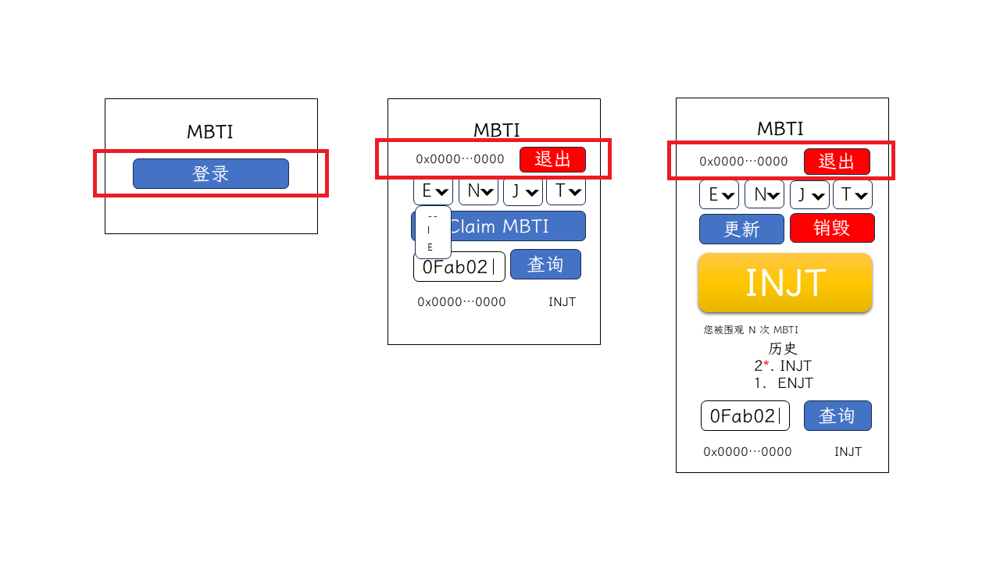

# MetaMask 登录及事件监听

前面我们已经搭建好了项目框架，接下来我们将完成应用的第一个功能——登录。

## 前情回顾

在写具体项目业务之前，我们对前面的内容进行简要的回顾。

`ethereum.request` 是一个通过 MetaMask 来进行 JSON-RPC API 请求提交的方法。`ethereum.request` 有一个参数，必须传递一个带有 `method` 属性的对象，根据 `method` 的不同，该对象需要有不同的 `params` 数组，其返回值也会根据 `method` 而不同。

`eth_requestAccounts` 主要用于登录:

```ts
await window.ethereum.request({
  method: "eth_requestAccounts",
  params: [],
});
```

`eth_accounts` 方法可以用来获取当前 MetaMask 登录的账号地址，和 `eth_requestAccounts` 的使用方法一样，但会以数组形式返回账号地址：

```ts
await window.ethereum.request({
  method: "eth_accounts",
  params: [],
});
```

MetaMask 还提供了事件监听，`accountsChanged` 事件在账号登录状态改变后触发，回调函数的参数是一个数组，该数组内是目前登录的账号地址。

## 功能分析

登录相关的功能要求点击登录按钮，调起 MetaMask，并提示授权登录，当授权登录后，页面更新授权账号相关信息；当账号切换，应用也需要自动更新授权账号相关信息；通过 MetaMask 取消授权，应用自动退出。



在线框图中，应该完成登录，登录后显示登录账号地址及退出按钮的功能。

## 功能编写

我们不妨将这个功能抽离成一个组件，外部可向组件传入地址，根据地址是否存在判断当前是否登录，“登录”和“退出”分别对外暴露一个回调函数，点击按钮，触发对应的回调函数。

在 `src` 目录下创建 `components` 文件夹，并在该文件夹创建 `LoginLogout.tsx` 文件。在 `/src/components/LoginLogout.tsx` 文件中创建一个基础的函数式组件：

```tsx
export const LoginLogout = () => {
  return <>Hello LoginLogout</>;
};
```

并在 `/src/app/page.tsx` 中引入：

```tsx
import { Container } from "react-bootstrap";

import { LoginLogout } from "../components/LoginLogout";

export default function Home() {
  return (
    <Container as="main">
      <h1 className="text-center mt-5 mb-3">MBTI</h1>
      <LoginLogout />
    </Container>
  );
}
```

我们预览页面会发现页面上有 `Hello LoginLogout` 字样，说明我们引入新组件成功。

按之前的分析，我们在 `/src/components/LoginLogout.tsx` 定义组件接口类型，并实现基础逻辑，为了布局美观，我们使用 React Bootstrap 提供的布局组件进行优化：

```tsx
import { FC } from "react";
import { Button, Col, Row } from "react-bootstrap";

interface LoginLogoutProps
  extends Partial<Record<"onLogin" | "onLogout", () => any>> {
  address?: string;
}

export const LoginLogout: FC<LoginLogoutProps> = ({
  address,
  onLogin,
  onLogout,
}) =>
  address ? (
    <Row>
      <Col>{address}</Col>
      <Col as={Button} variant="danger" onClick={onLogout}>
        退出
      </Col>
    </Row>
  ) : (
    <Button className="w-100" onClick={onLogin}>
      登录
    </Button>
  );
```

我们可以在预览页面看到登录按钮。

在 `/src/app/page.tsx` 中为 `LoginLogout`组件添加 `address` 参数： `<LoginLogout address='0x0123456789'/>`，可以看到预览页面显示 `0x0123456789` 和退出按钮，UI 部分的工作就基本完成了。

接下来我们需要编写逻辑部分，这部分主要涉及 MetaMask 的登录，所以我们创建一个新的文件来写入这部分的业务。因为 `Window` 上挂载的 `ethereum` 不是原生的属性，我们需要为这部分增加类型说明，可以从 `@metamask/providers` 简单地获取 `ethereum` 类型，所以安装该 Node.js 包：

```bash
pnpm add @metamask/providers
```

在项目根文件夹创建一个以 `.d.ts` 结尾的文件，这里我们创建 `react-app-env.d.ts` 文件，并添加如下内容：

```ts
/// <reference types="react" />
import { MetaMaskInpageProvider } from '@metamask/providers';

declare global {
  interface Window {
    ethereum: MetaMaskInpageProvider;
  }
}
```

在 `src` 文件夹下创建 `models` 文件夹，在该文件夹下创建 `MetaMask.ts`，在该文件创建 `MetaMask` 类，在该类创建 `connectWallet` 方法，该方法可以连接钱包，并返回连接钱包的账户地址，并默认导出一个 `MetaMask` 实例：

```ts
class MetaMask {
  async connectWallet() {
    // 如果未安装 MetaMask
    if (!window?.ethereum) throw new Error('MetaMask is not installed!');

    const [account] = (await window?.ethereum.request({
      method: 'eth_requestAccounts',
    })) as string[];
    return account;
  }
}

export default new MetaMask();
```

我们在 `/src/app/page.tsx` 文件中创建一个 `userAddress` 来存储连接的钱包地址，并给“登录”按钮绑定前面创建的 `connectWallet` 方法，其返回值存储到 `userAddress`, `userAddress` 作为 `address` 的值传入 `LoginLogout`（`'use client'` 表示该组件只在客户端渲染）：

```tsx
'use client'

import { useState } from 'react';
import { Container } from 'react-bootstrap';

import { LoginLogout } from '../components/LoginLogout';
import metaMaskStore from '../models/MetaMask';

export default function Home() {
  const [userAddress, setUserAddress] = useState<string>();

  const onLogin = async () => setUserAddress(await metaMaskStore.connectWallet())

  return (
    <Container as="main">
      <h1 className='text-center mt-5 mb-3'>MBTI</h1>
      <LoginLogout address={userAddress} onLogin={onLogin} />
    </Container>
  )
}
```

此时，我们可以点击“登录”按钮，MetaMask 弹出弹框，完成登录后页面显示当前连接的地址和“退出”按钮。此时，我们刷新页面，会发现页面显示未登录状态，但我们并未断开钱包与该网站的连接。

我们需要向 MetaMask 发出请求，询问连接账号情况，以解决这个问题。在 `/src/app/page.tsx` 中添加  `handleRequestAccounts` 函数，函数的主要功能是发送 `method` 为 `eth_accounts` 的请求，并将返回的第一个元素存储到 `userAddress`，在一个新的 `useEffect` 中调用 `handleRequestAccounts`，因为每次刷新 `useEffect` 可能调用 `handleRequestAccounts` 两次，我们将定义 `handleRequestAccounts` 函数的内容用 `useCallback` 包裹起来，进行缓存：

```tsx
'use client'

import { useCallback, useEffect, useState } from 'react';
import { Container } from 'react-bootstrap';

import { LoginLogout } from '../components/LoginLogout';
import metaMaskStore from '../models/MetaMask';

export default function Home() {
  const [userAddress, setUserAddress] = useState<string>();

  const handleRequestAccounts = useCallback(async () => {
    const accounts = await window.ethereum.request<string[]>({
      method: "eth_accounts",
      params: [],
    });

    setUserAddress(accounts?.[0]);
  }, []);

  useEffect(() => { handleRequestAccounts() }, []);

  const onLogin = async () => setUserAddress(await metaMaskStore.connectWallet())

  return (
    <Container as="main">
      <h1 className='text-center mt-5 mb-3'>MBTI</h1>
      <LoginLogout address={userAddress} onLogin={onLogin} />
    </Container>
  )
}

```

刷新预览页面，发现页面已经是登录状态。这里还有一点小问题，再连接一个账号，当切换账号后，页面上显示的账号不能自动切换，需要手动再刷新页面；因为这里账号切换，需要改变页面多处的状态，所以，我们应该监听账号切换事件，当账号切换时，页面自动刷新。在 `/src/models/MetaMask.ts` 中增加构造函数，构造函数中监听账号切换事件：

```ts
class MetaMask {
  constructor() {
    window?.ethereum?.on('accountsChanged', () => location.reload());
  }

  async connectWallet() {
    if (!window?.ethereum) throw new Error('MetaMask is not installed!');

    const [account] = (await window.ethereum.request({
      method: 'eth_requestAccounts',
    })) as string[];
    return account;
  }
}

export default new MetaMask();
```

最后我们通过 MetaMask 断开所有账号连接，预览页面自动刷新为未登录状态。

本节课，我们完成了 MetaMask 登录相关功能。

