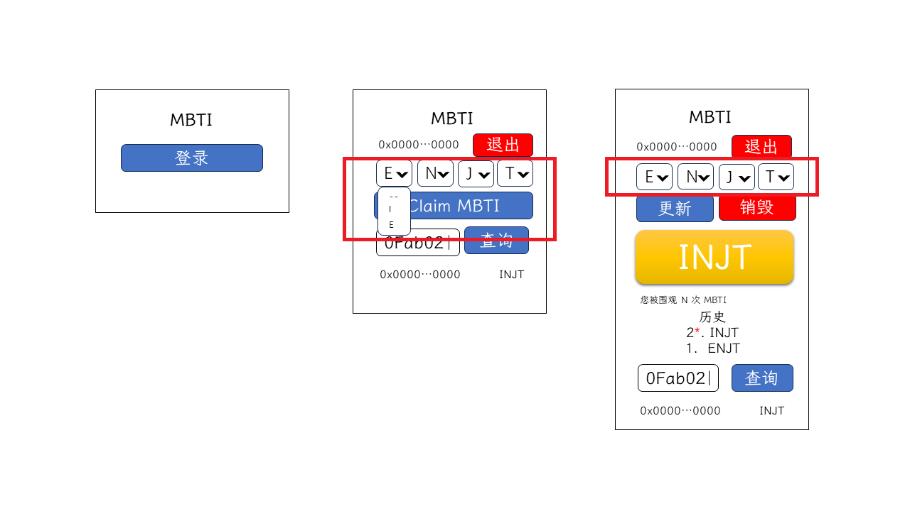

# 第十二讲 创建 MBTI 记录

前面的课程我们实现了通用性的基础功能，比如连接钱包、前端退出登录等，接下来我们将实现更贴近示例项目的业务。

## 需求分析



我们需要创建 MBTI 记录，这里就需要调用合约了，通过合约中的 `claimMBTI` 方法记录 MBTI。

| 类别 | 方法/事件名  | payable | 功能 | 参数 |
| :--: | :--: | :--: | :-- | :-- |
| 方法 | `claimMBTI` | 否 | 创建当前账户的 MBTI 记录 | MBTI 类型 |

## 要点回顾

这里可以通过前面的一个小例子回顾如何使用 ethers.js 进行合约交互：

```javaScript
// 获取 provider
const provider = window.ethereum ? new ethers.BrowserProvider(window.ethereum) : ethers.getDefaultProvider();

// 获取 signer
const signer = provider?.getSigner();

// 构建 Contract 实例,注意此处传入的是 Signer 实例，可以执行写操作；反之如果传入 Provider 实例，则不能执行写操作；
const contract = new Contract(CONTRACT_ADDRESS, abi, PROVIDER_OR_SIGNER);

// 执行只读函数，直接返回结果
const decimals = await contract.decimals();

// 换算获取 amount
const amount = parseUnits("1.0", 18);
// 执行写操作，返回交易对象
const tx = await contract.transfer(RECIPIENT_ADDRESS, amount);
// 等待交易执行完成
await tx.wait();
```

## 功能编写

我们先来构建项目的 UI 组件，这里需要一个选择器组件，该组件需要 4 个选择器组合，每个选择器的选项是对应 MBTI 顺序的选项，在 `/src/components` 文件夹下，创建 `MbtiSelect.tsx`：

```tsx
import { FC } from "react";
import { Col, Form, Row } from "react-bootstrap";

import { convertMbtiToDecimalNumber, convertMbtiToString, MBTI_TYPE } from "../utils/mbti";

interface MbtiSelectProp {
  mbti?: number, // 组件传参，MBTI 对应的十进制数
  onChange?: (mbti: number) => any, // 当 MBTI 修改，触发该回调，其参数是修改后的 MBTI 对应的十进制数
}

export const MbtiSelect: FC<MbtiSelectProp> =
  ({ mbti = 0, onChange }) => {
    // 将传入的 MBTI 十进制数转化为 MBTI 字符串数组
    const mbtiItemArr = convertMbtiToString(
      mbti < 0 || mbti > 15 ? 0 : mbti
    ).split("");

    // 当 Select 组件修改值，将修改的位置和修改后的值传入，并将最后的结果转化成 MBTI 对应的十进制值，触发函数回调
    const handleChangeType = (typeIndex: number, item: string) =>
      onChange?.(
        convertMbtiToDecimalNumber(
          mbtiItemArr.reduce((pre, cur, index) =>
            pre + (index === typeIndex ? item : cur), ""
          )
        )
      )

    return <Row className="my-2">
      {MBTI_TYPE.map((typeItem, typeIndex) =>
        <Col key={typeItem.toString()}>
          <Form.Select
            value={mbtiItemArr[typeIndex]}
            onChange={
              ({ target: { value } }) =>
                handleChangeType(typeIndex, value)
            }
          >
            {typeItem.map(item =>
              <option key={item} value={item}>{item}</option>
            )}
          </Form.Select>
        </Col>
      )}
    </Row>
  }
```

这是一个受控组件，可以传入一个 MBTI 的值，并显示结果，如果有修改，将触发回调，回调的参数是修改后 MBTI 对应的十进制值。

我们在 `/src/app/page.tsx` 中使用 `MbtiSelect` 组件，特别注意该组件只在登录情况下显示：

```tsx
// ...
import { MbtiSelect } from '../components/MbtiSelect';
// ...
export default function Home() {
// ...
  const [userAddress, setUserAddress] = useState<string>();

  const [mbtiSelectValue, setMbtiSelectValue] = useState<number>(0)
// ...
  return (
    <Container as="main">
      <h1 className='text-center mt-5 mb-3'>MBTI</h1>

      <LoginLogout {...{ address: userAddress, onLogin, onLogout }} />

      {userAddress && <MbtiSelect mbti={mbtiSelectValue} onChange={setMbtiSelectValue}/>}
    </Container>
  )
}
```

在编写和区块链进行交互的代码之前，需要在项目安装 ethers.js，在命令行执行命令：

```bash
pnpm add ethers
```

在 `/src` 创建 `abi` 文件夹，在该文件夹中创建 `mbti.json`，并将 ABI 添加到该文件：

```json
[
  {
    "inputs": [
      {
        "internalType": "int8",
        "name": "mbtiType",
        "type": "int8"
      }
    ],
    "name": "claimMBTI",
    "outputs": [],
    "stateMutability": "nonpayable",
    "type": "function"
  },
  {
    "inputs": [],
    "name": "destroyMBTI",
    "outputs": [],
    "stateMutability": "payable",
    "type": "function"
  },
  {
    "inputs": [],
    "stateMutability": "nonpayable",
    "type": "constructor"
  },
  {
    "anonymous": false,
    "inputs": [
      {
        "indexed": true,
        "internalType": "address",
        "name": "user",
        "type": "address"
      },
      {
        "indexed": false,
        "internalType": "int8",
        "name": "mbtiType",
        "type": "int8"
      }
    ],
    "name": "MBTIUpdated",
    "type": "event"
  },
  {
    "inputs": [
      {
        "internalType": "address payable",
        "name": "user",
        "type": "address"
      },
      {
        "internalType": "uint256",
        "name": "value",
        "type": "uint256"
      }
    ],
    "name": "sendContractBalance",
    "outputs": [],
    "stateMutability": "nonpayable",
    "type": "function"
  },
  {
    "inputs": [
      {
        "internalType": "int8",
        "name": "mbtiType",
        "type": "int8"
      }
    ],
    "name": "updateMBTI",
    "outputs": [],
    "stateMutability": "payable",
    "type": "function"
  },
  {
    "inputs": [
      {
        "internalType": "address",
        "name": "user",
        "type": "address"
      }
    ],
    "name": "getMBTI",
    "outputs": [
      {
        "internalType": "int8",
        "name": "",
        "type": "int8"
      }
    ],
    "stateMutability": "view",
    "type": "function"
  },
  {
    "inputs": [],
    "name": "getMyMBTI",
    "outputs": [
      {
        "internalType": "int8",
        "name": "",
        "type": "int8"
      }
    ],
    "stateMutability": "view",
    "type": "function"
  }
]
```

在 `/src/models` 文件夹中创建一个 `AbiAndAddress.ts` 文件，在该文件配置合约的 ABI 和合约地址：

```ts
import mbtiAbi from "../abi/mbti.json";

export const abiAndAddress = {
  mbti: {
    abi: mbtiAbi,
    address: '0x9f47Ea16345c09523a6A1DA1B84f5EB4E1bea221',
  },
};

```

我们回顾前面的示例，要和区块链交互大概分几个步骤：获取 `provider`，获取 `signer`，创建合约对象，和合约交互。如果我们把上述逻辑都放在一个方法里，可能每次都要重复执行部分逻辑，我们将其拆分成若干步，便于调用。

在 `/src/models/MetaMask.ts` 为 `MetaMask` 类添加 `getBrowserProvider` 方法，该方法用于获取 `provider`, 当用户浏览器未安装 MetaMask 时程序报错，并增加了一个缓存变量，每次创建 `provider` 会在 `browserProvider` 缓存，避免反复创建 `BrowserProvider` 实例：

```ts
import { BrowserProvider, ethers } from 'ethers';
// ...
class MetaMask {
  browserProvider?: BrowserProvider;
// ...
  getBrowserProvider() {
    if (!globalThis.window?.ethereum)
      throw new Error('MetaMask is not installed!');

    if (!this.browserProvider)
      this.browserProvider = new ethers.BrowserProvider(globalThis.window.ethereum);

    return this.browserProvider;
  }
}
// ...
```

在 `/src/models/MetaMask.ts` 为 `MetaMask` 类添加 `getSigner` 方法，该方法用于获取 `signer`，并将其缓存至 `signer` 变量，当 `browserProvider`、`localStorage` 的 `account` （该值存在即账户已连接该网址）和 `signer` 都存在就返回缓存的 `signer`，`localStorage` 的 `account` 不存在则请求连接钱包，`browserProvider` 不存在则获取 `provider`，`signer` 不存在则获取 `signer`：

```ts
import { BrowserProvider, ethers, JsonRpcSigner } from 'ethers';
// ...
class MetaMask {
// ...
  browserProvider?: BrowserProvider;

  signer?: JsonRpcSigner;
// ...
  async getSigner() {
    if (this.browserProvider && localStorage?.account && this.signer) return this.signer;

    if (!localStorage.account) await this.connectWallet();

    if (!this.browserProvider) this.getBrowserProvider();

    return (this.signer = await this.browserProvider!.getSigner());
  }
}
// ...
```

为了使结构更简单在 `/src/models/MetaMask.ts` 创建 `getDaiContract` 和 `getDaiContractWithSigner` 用来创建可读或可读可写的合约对象：

```ts
import { BrowserProvider, Contract, ethers, JsonRpcSigner } from 'ethers';
// ...
interface ContractAddressAndAbi {
  address: string,
  abi: ethers.Interface | ethers.InterfaceAbi,
}
// ...
class MetaMask {
// ...
  async getDaiContract({ address, abi }: ContractAddressAndAbi) {
    await this.switchDefaultChain();

    return new Contract(address, abi, this.getBrowserProvider());
  }

  async getDaiContractWithSigner({ address, abi }: ContractAddressAndAbi) {
    await this.switchDefaultChain();

    return new Contract(address, abi, await this.getSigner());
  }
}
```

考虑到合约的事件比较多，在 `/src/models` 文件夹创建一个 `Mbti.ts` 文件，在 `Mbti` 类中创建一个 `claimMBTI` 方法：

```ts
import { abiAndAddress } from './AbiAndAddress';
import metaMaskStore from './MetaMask';

class Mbti {
  async claimMBTI(value: number){
    const mbtiContract = await metaMaskStore.getDaiContractWithSigner(abiAndAddress.mbti);

    return mbtiContract.claimMBTI(value);
  }
}

export default new Mbti();
```

在 `/src/app/page.tsx` 中添加 `Claim MBTI` 按钮及对应的点击事件：

```tsx
// ...
import { Button, Container } from 'react-bootstrap';
// ...
import mbtiStore from '../models/Mbti';
// ...
export default function Home() {
// ...
  return (
    <Container as="main">
      <h1 className='text-center mt-5 mb-3'>MBTI</h1>

      <LoginLogout {...{ address: userAddress, onLogin, onLogout }} />

      {userAddress && <MbtiSelect mbti={mbtiSelectValue} onChange={setMbtiSelectValue} />}

      {userAddress && <Button
        className='w-100'
        onClick={() => mbtiStore.claimMBTI(mbtiSelectValue)}
      >Claim MBTI</Button>}
    </Container>
  )
}
```

当我们点击“Claim MBTI”会调起钱包，取消后会报错，我们对异常进行处理，在 `/src/app/page.tsx` 添加处理：

```tsx
globalThis.addEventListener?.('unhandledrejection', ({ reason }) => {
  const { message, body } = reason || {};

  const tips = body?.detail || message;

  if (tips) alert(tips);
});
```

再次点击“Claim MBTI”调起钱包后取消，弹出错误信息（开发环境还是会报错，执行 `pnpm build` 和 `pnpm start`，进入生产环境，再次尝试，Next.js 的全局报错会消失），全局错误消失；调起钱包后可以正常执行合约方法，说明该功能已完成。
