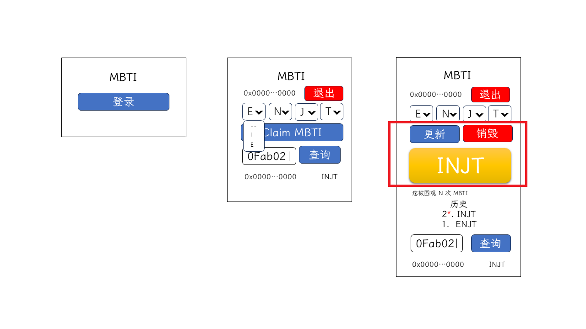

# 第十三讲 查看、更新、销毁 MBTI 卡片

前面我们制作了创建记录的组件，本讲我们一起完成查看、更新、销毁 MBTI 卡片的功能。

## 需求分析



要完成查看、更新、销毁涉及如下合约方法：

| 类别 | 方法/事件名 | payable | 功能 | 参数 |
| :--: | :--: | :--: | :-- | :-- |
| 方法 | `destroyMBTI` | 是（需大于等于 0.001 ETH） | 销毁（删除）当前账户的 MBTI 记录 | - |
| 方法 | `updateMBTI` | 是（需大于等于 0.001 ETH） | 修改当前账户的 MBTI | MBTI 类型 |
| 方法 | `getMyMBTI` | 否 | 获取当前账户的 MBTI | - |

## 功能实现

先在 `/src/models/Mbti.ts` 为 `Mbti` 类添加一个用来获取当前用户 MBti 的 `getMyMBTI` 方法：

```ts
// ...
class Mbti {
// ...
  async getMyMBTI() {
    const mbtiContract = await metaMaskStore.getDaiContractWithSigner(abiAndAddress.mbti);

    return mbtiContract.getMyMBTI();
  }
}
```

在 `/src/app/page.tsx` 中定义一个 `myMbti` 存储当前用户的 MBTI，因为 MBTI 的有效值是 `0`-`16`，这里将默认值设为 `-1`；在创建后不显示 “Claim MBTI”，所以为其添加一个 `myMbti < 0` 条件，在点击该按钮后，需要更新 `myMbti`，所以把该按钮的点击事件抽出一个 `onClaimMBTI` 函数（需要等待合约确认再更新页面数据）；增加根据 `myMbti` 显示 MBTI，显示条件是 `userAddress` 存在（用户已登录）和 `myMbti` 有效；将几个显示条件是 `userAddress` 存在（用户已登录）的组件合并（用 `<></>` 包裹）：

```tsx
// ...
import { Button, Card, Container } from 'react-bootstrap';
// ...
import { convertMbtiToString } from '../utils/mbti';
// ...
  const [myMbti, setMyMbti] = useState<number>(-1);

// ...
  const onClaimMBTI = async () => {
    const tx = await mbtiStore.claimMBTI(mbtiSelectValue);
    await tx.wait();
    setMyMbti(mbtiSelectValue);
  }
// ...
      {userAddress && <>
        <MbtiSelect mbti={mbtiSelectValue} onChange={setMbtiSelectValue} />

        {myMbti < 0 && <Button className='w-100' onClick={onClaimMBTI} >Claim MBTI</Button>}

        {myMbti >= 0 && <Card body className='fs-1 bg-warning-subtle text-center mt-3 mb-5 shadow'>
          {convertMbtiToString(myMbti)}
        </Card>}
      </>}
    </Container>
// ...
```

点击 “Claim MBTI” ，MetaMask 弹出弹框，确认后即可以创建 MBTI，并且可以显示 MBTI 卡片。当刷新页面后，MBTI 卡片丢失，页面初始化未请求当前登录用户的 MBTI 记录。

这里将 `handleRequestAccounts` 函数修改为 `handlePageInitRequest`， 并在处理完账号后，请求当前用户的 MBTI，如果当前用户未登录，直接将 `myMbti` 设为 `-1`，否则将返回的值存储到 `myMbti`，在请求过程中如果用户未初始化 MBTI 会报错 `MBTI is not initialized.`，该错误不特殊处理，其他错误向外层抛出，在 `/src/app/page.tsx` 修改：

```tsx
// ...
export default function Home() {
// ...
  const handlePageInitRequest = useCallback(async () => {
    const accounts = await window.ethereum.request<string[]>({
      method: "eth_accounts",
      params: [],
    });
    const localStorageAccount = localStorage?.account;

    setUserAddress(
      () => localStorage.account =
        (!accounts?.length || !localStorageAccount)
          ? ""
          : accounts.includes(localStorageAccount)
            ? localStorageAccount : accounts[0]
    );

    try {
      setMyMbti(localStorageAccount ? await mbtiStore.getMyMBTI() : -1);
    } catch (error: any) {
      if (error?.reason !== "MBTI is not initialized.")
        throw error;
    }
  }, []);

  useEffect(() => { handlePageInitRequest() }, []);
// ...
}
// ...
```

刷新页面，如果已创建 MBTI，页面将显示 MBTI 卡片。

接下来，我们处理“更新”和“销毁”。先在 `/src/models/Mbti.ts` 为 `Mbti` 类添加 `updateMBTI`（更新） 和 `destroyMBTI`（销毁） 方法，这两个都需要调用可支付合约方法，我们支付要求的最小值（0.001 ETH），支付时在调用合约方法最后添加参数 `{value: VALUE}`，`VALUE` 为 Bigint 类型数值：

```ts
import { parseEther } from 'ethers';
// ...
class Mbti {
// ...
  async updateMBTI(mbti: number) {
    const mbtiContract = await metaMaskStore.getDaiContractWithSigner(abiAndAddress.mbti);

    return mbtiContract.updateMBTI(mbti, {value: parseEther("0.001")});
  }

  async destroyMBTI() {
    const mbtiContract = await metaMaskStore.getDaiContractWithSigner(abiAndAddress.mbti);

    return mbtiContract.destroyMBTI({value: parseEther("0.001")});
  }
}
```
 
在 `/src/app/page.tsx` 中，创建 `onUpdateMBTI`（更新） 和 `onDestroyMBTI`（销毁）函数，在 `myMbti >= 0` 条件下添加“更新”和“销毁”按钮：

```tsx
// ...
import { Button, Card, Col, Container, Row } from 'react-bootstrap';
// ...
export default function Home() {
// ...
  const onUpdateMBTI = async () => {
    if(mbtiSelectValue === myMbti) return;

    const tx = await mbtiStore.updateMBTI(mbtiSelectValue);
    await tx.wait();
    setMyMbti(mbtiSelectValue);
  }

  const onDestroyMBTI = async () => {
    const tx = await mbtiStore.destroyMBTI();
    await tx.wait();
    setMyMbti(-1);
  }

  return (
    <Container as="main">
      <h1 className='text-center mt-5 mb-3'>MBTI</h1>

      <LoginLogout {...{ address: userAddress, onLogin, onLogout }} />

      {userAddress && <>
        <MbtiSelect mbti={mbtiSelectValue} onChange={setMbtiSelectValue} />

        {myMbti < 0 && <Button className='w-100' onClick={onClaimMBTI} >Claim MBTI</Button>}
        {myMbti >= 0 && <>
          <Row className='d-flex justify-content-around'>
            <Col as={Button} xs={5} onClick={onUpdateMBTI}>更新</Col>
            <Col as={Button} variant="danger" xs={5} onClick={onDestroyMBTI}>销毁</Col>
          </Row>

          <Card body className='fs-1 bg-warning-subtle text-center mt-3 mb-5 shadow'>
            {convertMbtiToString(myMbti)}
          </Card>
        </>}
      </>}
    </Container>
  )
}
```

在选择器组件选择和现在相同的 MBTI，点击“更新”，无其他状态改变；在选择器组件选择和现在不一样的 MBTI，点击“更新”，确认 MetaMask 交易（MetaMask 提示除 GAS 费外需要支付 0.001 ETH），等待交易确认，MBTI 卡片更新；点击“销毁”，确认 MetaMask 交易（MetaMask 提示除 GAS 费外需要支付 0.001 ETH），等待交易确认，MBTI 卡片消失。

现在，我们完成了本节的基本任务。
