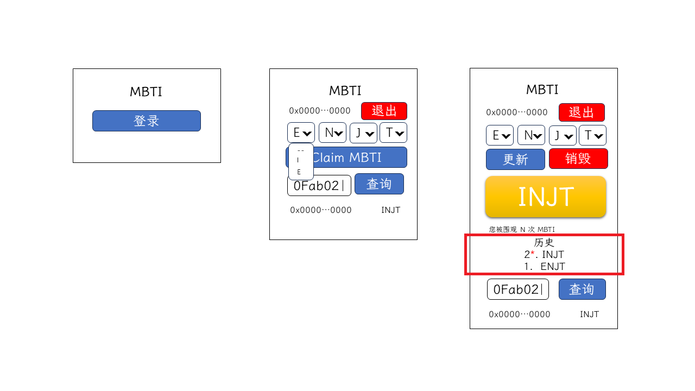

# 第十四讲 MBTI 历史显示

前面我们完成了创建、查看、更新、销毁 MBTI 卡片，接下来我们完成 MBTI 历史记录显示。

## 需求分析



要显示历史记录，目前合约未提供相关方法，只能通过合约事件进行查询。

| 类别 | 方法/事件名 | payable | 功能 | 参数 |
| :--: | :--: | :--: | :-- | :-- |
| 事件 | `MBTIUpdated` | N/A | 某一账户的 MBTI 更新了 | 用户地址（indexed），更新后的类型 |

## 回顾

```javaScript
const abi = [
  "event Transfer(address indexed from, address indexed to, uint amount)"
]

const contract = new Contract(CONTRACT_ADDRESS, abi, provider)

const filter = contract.filters.Transfer
const events = await contract.queryFilter(filter)
```

上面的例子可以看出，可以通过 `Contract` 实例上的 [`queryFilter()`](https://docs.ethers.org/v6/api/contract/#BaseContract-queryFilter) 方法可以查询该合约上的事件，可以传入参数进行过滤，其第一个参数可以传入和上面 `on()` 方法第一个参数相同的参数；第二和第三个参数可以指定需要查询的起始和终止区块，限定查询的区块范围。

## 功能实现

我们先完成 UI 部分，在 `/src/components` 目录下创建 `ClaimHistory.tsx` 文件，创建 `ClaimHistory` 组件，该组件可**正序**传入需要显示列表，该列表是由 MBTI 记录**倒序**排列的（`reversed` 表示顺序列表的编号倒叙排列）：

```tsx
import { FC } from "react"

interface ClaimHistoryProps {
  record: string[]
}

export const ClaimHistory: FC<ClaimHistoryProps> = ({ record }) => {
  return <>
    <h2 className="text-center mt-1">历史</h2>
    <ol reversed className="list-unstyled">
      {record
        ?.toReversed()
        .map((item, index, arr) =>
          <li key={item + index} className="text-center">
            <span className="me-2">
              {arr.length - index}
              {index === 0 && <sup className="text-danger">*</sup>}.
            </span>
            {item}
          </li>
        )}
    </ol>
  </>
}
```

在 `/src/app/page.tsx` 引入该组件，定义 `myHistory` 变量，需要展示的历史记录倒序存储在 `myHistory`，当 `myHistory` 为空数组时组件不显示：

```tsx
// ...
import { ClaimHistory } from '../components/ClaimHistory';
// ...
export default function Home() {
// ...
  const [myHistory, setMyHistory] = useState<string[]>([]);
// ...
      {userAddress && <>
        <MbtiSelect mbti={mbtiSelectValue} onChange={setMbtiSelectValue} />

        {myMbti < 0 && <Button className='w-100' onClick={onClaimMBTI} >Claim MBTI</Button>}

        {myMbti >= 0 && <>
          <Row className='d-flex justify-content-around'>
            <Col as={Button} xs={5} onClick={onUpdateMBTI}>更新</Col>
            <Col as={Button} variant="danger" xs={5} onClick={onDestroyMBTI}>销毁</Col>
          </Row>

          <Card body className='fs-1 bg-warning-subtle text-center mt-3 mb-5 shadow'>
            {convertMbtiToString(myMbti)}
          </Card>
        </>}

        {myHistory.length > 0 && <ClaimHistory record={myHistory} />}
      </>}
// ...
}
```

接下来创建获取历史记录的方法，在 `/src/model/Mbti.ts` 为 `Mbti` 类添加 `getRecord` 方法，该方法需要通过合约事件来查询历史记录：

```ts
// ...
  async getRecord(address: string) {
    const contract = await metaMaskStore.getDaiContract(abiAndAddress.mbti);

    const filter = await contract.filters.MBTIUpdated(address);
    const eventLogs = await contract.queryFilter(filter) as EventLog[];

    return eventLogs.map(({ args }) => Number((args[1] as BigInt).toString()))
      .filter(item => item >= 0)
  }
// ...
```

`contract.filters.MBTIUpdated(address)` 可以创建一个 `MBTIUpdated` 事件的筛选器，该筛选器要求事件的第一个参数是 `address`；`queryFilter` 返回 `EventLog` 对象数组，`EventLog` 的 `args` 是 `MBTIUpdated` 的参数，第二个参数是 MBTI 对应的十进制，销毁 MBTI 时该值为 `-1`。

在页面初始化时添加获取 MBTI 记录的请求，在点击“更新”按钮时，更新 MBTI 记录，在 `/src/app/page.tsx` 修改：

```tsx
// ...
  const handlePageInitRequest = useCallback(async () => {
    const accounts = await window.ethereum.request<string[]>({
      method: "eth_accounts",
      params: [],
    });
    const localStorageAccount = localStorage?.account;

    setUserAddress(
      () => localStorage.account =
        (!accounts?.length || !localStorageAccount)
          ? ""
          : accounts.includes(localStorageAccount)
            ? localStorageAccount : accounts[0]
    );

    try {
      setMyMbti(localStorageAccount ? await mbtiStore.getMyMBTI() : -1);
    } catch (error: any) {
      if (error?.reason !== "MBTI is not initialized.")
        throw error;
    }

    setMyHistory(
      (localStorageAccount ? await mbtiStore.getRecord(localStorageAccount) : [])
        .map(item => convertMbtiToString(item))
    )
  }, []);
// ...
  const onUpdateMBTI = async () => {
    if (mbtiSelectValue === myMbti) return;

    const tx = await mbtiStore.updateMBTI(mbtiSelectValue);
    await tx.wait();

    setMyMbti(mbtiSelectValue);
    setMyHistory(myHistory => [...myHistory, convertMbtiToString(mbtiSelectValue)])
  }
// ...
```

刷新页面，等待请求完成，显示历史记录；更新 MBTI，等待请求完成，历史记录也更新。自此，本节的主要功能就开发完毕了。
