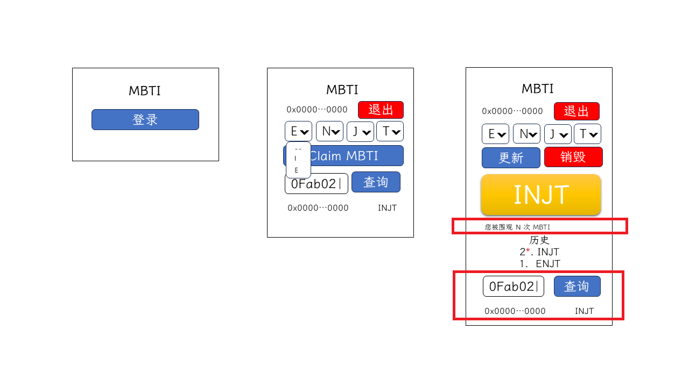

# 第十五讲 查询其他用户的 MBTI

前面我们完成了 MBTI 历史记录的显示，接下来我们继续完成查询其他用户的 MBTI 功能。

## 需求分析



本节我们需要完成的功能有，登录情况下，页面末尾显示一个专供查询用户 MBTI 的组件，该组件有一个输入框和一个查询按钮，在输入框输入想要查询的地址，点击查询，在下面会显示所查询的地址及该地址当前的 MBTI。在 MBTI 卡片下，显示当前账户被查询的次数。

需要注意的是，查询某一账户的 MBTI 可以直接通过合约，这里为了展示更多的请求合约的方法，特别要求将相关合约的查询放到后端，这里前端向后端发送请求，后端将合约获取的数据返回给其前端，在此过程中将被查询账户的被查询次数加 1，被查询次数需要另外暴漏一个接口供页面查询。还有一个比较特别的要求，我们要求每次查询都需要签名验证。

因为这里的项目主要是展示区块链相关技术，尽可能简化涉及的其他技术，被查询次数的记录就不采用数据库了，而是直接存储在内存，为了读取的高效，采用 [`Map`](https://developer.mozilla.org/zh-CN/docs/Web/JavaScript/Reference/Global_Objects/Map)。

Next.js 自带后端功能，我们继续在原项目中写后端代码，这样还可以复用一部分代码。

## 关键方法/函数

这一节主要希望展示如何在后端进行合约查询，以及签名及签名验证，这些在前面介绍得比较少。

在后端，我们可以通过如下方式获取 `provider`：

```ts
const provider = new ethers.JsonRpcProvider(url);
```

参数 `url` 是 RPC URL。

顺便提一下，在后端无法像前端一样调用 MetaMask 接口，触发签名或交易确认，需要构造 [`wallet`](https://docs.ethers.org/v6/api/wallet/#Wallet) 实例，使用它对区块链上的数据进行修改，无需 MetaMask。

```ts
const wallet = new ethers.Wallet(PRIVATE_KEY, provider);
```

在本节另一个比较关键的是签名：

```ts
// 请求签名
const signature = await signer.signMessage(MESSAGE);

// 签名验证
const address = verifyMessage(MESSAGE, signature);
```

可以通过 `signer` 实例上的 `signMessage` 方法进行签名，需要给它传入需要签名的字符串，返回签名结果 hash；ethers.js 为我们提供了 `verifyMessage` 方法，该方法需要传入待签名的字符串和签名后的结果，返回为得到该签名结果提供私钥的账户地址。

## 功能实现

我们先完成查询的 UI 组件，在 `/src/components` 目录下创建一个 `SearchMbti.tsx` 文件，我们将搜索框和搜索按钮封装在一个表单元素中，下面显示搜索结果，为了方便使用，由于表单元素只有一个按钮子元素，可以将该按钮元素的 `type` 设置成 `submit`，表单元素的提交事件和该按钮的点击事件绑定，该组件对外暴漏 `onSearch` 方法，每次提交表单都会触发该方法，显示结果也需要从外部传入:

```tsx
import { FormEvent, useState } from "react";
import { Button, Col, Form, Row } from "react-bootstrap";

export interface SearchMbtiProps
  extends Partial<Record<"userAddress" | "mbti", string>> {
  onSearch?: (address: string) => any;
}

export const SearchMbti = ({
  userAddress,
  mbti,
  onSearch,
}: SearchMbtiProps) => {
  const [address, setAddress] = useState<string>("");

  const handleSubmit = (event: FormEvent<HTMLElement>) => {
    event.stopPropagation();
    event.preventDefault();
    onSearch?.(address);
  };

  return (
    <>
      <Row as={Form} className="mt-4 mb-3" onSubmit={handleSubmit}>
        <Col xs={9}>
          <Form.Control
            value={address}
            onChange={({ target: { value } }) => setAddress(value)}
          />
        </Col>
        <Col xs={3}>
          <Button className="w-100" type="submit" disabled={!address.length}>
            查询
          </Button>
        </Col>
      </Row>
      {userAddress && mbti && (
        <Row className="mb-5">
          <Col>{userAddress}</Col>
          <Col className="text-end">{mbti}</Col>
        </Row>
      )}
    </>
  );
};
```

接下来在首页添加该组件，在 `/src/app/page.tsx` 添加组件，并为该组件传入参数，为了在后端进行签名我们需要得到一个签名进行测试，所以 `onSearch` 事件的回调我们设置为先签名，并打印签名的结果，签名的内容是被查询的账户地址，并且使用 `getAddress` 方法进行标准化：

```tsx
'use client'

import { getAddress } from 'ethers';
import { useCallback, useEffect, useState } from 'react';
// ...
import { MbtiSelect } from '../components/MbtiSelect';
import { SearchMbti } from '../components/SearchMbti';
import mbtiStore from '../models/Mbti';
// ...
  const [myHistory, setMyHistory] = useState<string[]>([]);

  const [searchAddress, setSearchAddress] = useState<string>('');
  const [searchMbti, setSearchMbti] = useState<string>('');

  const handlePageInitRequest = useCallback(async () => {
    const accounts = await window.ethereum?.request<string[]>({
      method: "eth_accounts",
// ...
  const handleSearchMbti = async (address: string) => {
    const signature = await metaMaskStore.signer?.signMessage(getAddress(address));

    console.log(address, signature)
  }

  return (
// ...
        {myHistory.length > 0 && <ClaimHistory record={myHistory} />}

        <SearchMbti userAddress={searchAddress} mbti={searchMbti} onSearch={handleSearchMbti} />
      </>}
    </Container>
  )
```

在开发环境下，输入待查询的地址，点击“查询”按钮，MetaMask 会弹出签名请求，签名后，控制台会打印请求的地址及签名结果，这个数据需要记录一下，供后面后端开发使用。

这里可以在 `/src/models/ChainInfo.ts` 为 `Sepolia Ether` 网络增加一些 `rpcUrls`:

```ts
  rpcUrls: [
    'https://1rpc.io/sepolia',
    'https://rpc2.sepolia.org/',
    'https://sepolia.infura.io/v3/',
  ],
```

接下来，进行后端 API 开发，在 `/src/app/api/mbti/[address]` 目录下创建 `route.ts` 文件，该文件内创建了两个函数——`POST` 和 `GET`，表示可以向 `/api/mbti/[address]` 发送 `POST` 和 `GET` 请求，并触发对应的函数，地址的 `[address]` 需要替换成被查询的账户地址，`countMap` 主要记录每个账户被查询的次数。`POST` 请求主要用于查询账户的 MBTI，需要在 `body` 附带签名结果 `signature` 和发送请求的账户地址 `myAddress`，`[address]` 是被查询 MBTI 的账户地址；`GET` 请求用于查询账户被查询的次数，`[address]` 是账户地址。Next.js 要求后端处理函数都需要返回 `Response` 实例。在 `POST` 请求中，签名验证的内容，和前端一致，是被查询的账户地址，并且需要标准化。代码如下：

```ts
import { ethers, getAddress, verifyMessage } from 'ethers';

import { abiAndAddress } from '../../../../models/AbiAndAddress';
import { defaultChainInfo } from '../../../../models/ChainInfo';

const url = defaultChainInfo.rpcUrls[0];
const { mbti: { abi, address: contractAddress } } = abiAndAddress;

const provider = new ethers.JsonRpcProvider(url);
const contract = new ethers.Contract(contractAddress, abi, provider);

const countMap = new Map<string, number>();

const CustomResponse = (value: any, status = 200) => new Response(JSON.stringify(value), { status });

const ErrorResponse = (error: string | any, status = 400) => CustomResponse({ error }, status);

const checkAddress = (address?: string) => {
  if (!address) return ErrorResponse('Address parameter is required', 404);
  if (!/^0[xX][0-9a-fA-F]{40}$/.test(address)) return ErrorResponse('Invalid input address', 404);
}

export async function POST(
  request: Request,
  { params: { address } }: { params: { address: string } }
) {
  const checkResult = checkAddress(address);
  if (checkResult) return checkResult;

  try {
    const normalizedAddress = getAddress(address);
    const { signature, myAddress } = await request.json();

    if (!signature) return ErrorResponse('invalid signature');
    if (getAddress(myAddress) !== verifyMessage(normalizedAddress, signature))
      return ErrorResponse('illegal signature');

    const value = Number(await contract.getMBTI(normalizedAddress));

    const count = (countMap.get(normalizedAddress) || 0) + 1;
    countMap.set(normalizedAddress, count);

    return CustomResponse({ address: normalizedAddress, value });
  } catch (error: any) {
    console.error(error);

    const { shortMessage } = error;
    if (shortMessage) return ErrorResponse(error);

    return ErrorResponse('Not found', 404);
  }
}

export function GET(
  _: Request,
  { params: { address } }: { params: { address: string } }
) {
  const checkResult = checkAddress(address);
  if (checkResult) return checkResult;

  try {
    const normalizedAddress = getAddress(address);

    const count = countMap.get(normalizedAddress) || 0;

    return CustomResponse({ count });
  } catch (error: any) {
    console.error(error);

    const { shortMessage } = error;
    if (shortMessage) return ErrorResponse(error);

    return ErrorResponse('Not found', 404);
  }
}

```

我们可以用上一步打印的结果，使用 API 调试工具进行调试。

接下来，我们将在前端接入已经做好的 API 接口，并完成查询次数的前端展示，修改 `/src/app/page.tsx`：

```ts
// ...
  const [searchMbti, setSearchMbti] = useState<string>('');
  const [viewTime, setViewTime] = useState<number>(0);

  const handlePageInitRequest = useCallback(async () => {
// ...
        throw error;
    }

    try {
      const res = await fetch(`/api/mbti/${localStorageAccount}`);
      const { count } = await res.json();
      setViewTime(count);
    } catch (error: any) {
      console.error(error);
    }

    setMyHistory(
      (localStorageAccount ? await
// ...
  const handleSearchMbti = async (address: string) => {
    const signature = await metaMaskStore.signer?.signMessage(getAddress(address));

    if (!signature || !userAddress) return;

    const res = await fetch(`/api/mbti/${address}`, {
      method: 'POST',
      body: JSON.stringify({ signature, myAddress: userAddress }),
    })

    const { address: searchAddress, value } = await res.json();
    setSearchAddress(searchAddress);
    setSearchMbti(convertMbtiToString(value));
  }
// ...
          <Card body className='fs-1 bg-warning-subtle text-center mt-3 mb-5 shadow'>
            {convertMbtiToString(myMbti)}
          </Card>
        </>}

        <p>您被围观 {viewTime} 次 MBTI</p>

        {myHistory.length > 0 && <ClaimHistory record={myHistory} />}
// ...
```

我们在输入框输入待查询的账户地址，点击查询，下面显示查询结果，如果查询的是当前的账户地址，刷新页面，查看次数加 1。

至此，我们基本完成了整个项目的代码部分，感谢大家。
