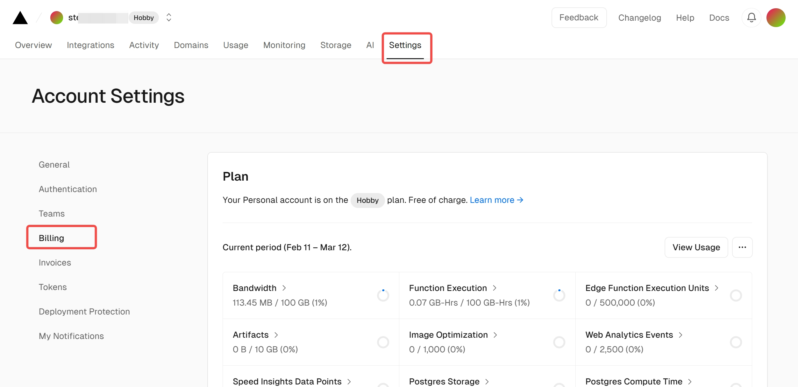

# 第十六讲 将项目部署到 Vercel

前面我们完成了项目的代码部分，接下来我们对项目进行部署。

## 常见的前端部署云服务方案

过去，我们部署一个纯前端项目需要自己启动一个静态服务器，并把打包好的前端项目上传到静态服务器的指定文件夹。随着云技术的发展，越来越多的云平台改变了原来繁琐的工作流程，使得部署工作变得简单高效。

我们常见的前端部署云服务方案有：

- [Netlify](https://www.netlify.com/)：个提供静态资源网络托管的综合平台，提供 CI 服务，能够将托管 GitHub、GitLab 等网站上的 Jekyll、Hexo、Hugo 等代码自动编译并生成静态网站。

- [Vercel](https://vercel.com/)：Vercel 的前端云为开发人员提供体验和基础设施，以构建、扩展和保护更快、更个性化的网络。

- [Cloudflare Page](https://pages.cloudflare.com/)：CloudFlare Pages 是一个 JAMstack 平台，供前端开发者协作和部署网站。

- [GitHub Pages](https://pages.github.com/)： 一个免费的静态网站托管服务，允许用户从 GitHub 仓库直接托管和发布静态网页。

## 使用 Vercel 部署项目

我们前面使用 Next.js 进行开发，Next.js 是 Vercel 团队开发的前端框架，**Vercel 对 Next.js 的部署支持相较其他平台更好**，所以这里我们介绍在 Vercel 部署项目。

这里我们针对 Vercel 平台上部署项目常用且重要的功能进行说明，更多功能请参考 [Vercel 的文档](https://vercel.com/docs)。

### Vercel 注册

如果之前已有 Vercel 的账号，可以跳过这一步。

访问 [Vercel 的注册页](https://vercel.com/signup)，选择适合自己的计划类型：

- Hobby：属于免费账户，适用于个人业余项目。

- Pro：收费账户，Hobby 类提供的功能 Pro 类都提供，还有更高的限制和团队功能。

这两类账号的具体区别和报价可以在 [价格](https://vercel.com/pricing) 页面找到。

选择账户类型后，需要输入自己名字，点击“Continue”。


Vercel 提供了多种方式关联注册：GitHub、GitLab、Bitbucket 和 Email，可以根据自己的使用习惯选择其中一种方式关联注册。


### 用户首页介绍

用户登录后，首页如下图，其中 ① 是用户名和当前用户的类型（一般是 Hobby 或 Pro），可以通过点击 ② 账号切换按钮进行账号切换（如果一个账号加入多个团队就需要通过此功能切换，团队可以由多个成员管理项目，但此功能是收费功能），③ 可以切换该账户的不同的功能页面（其中比较重要的是 Overview、Usage、Setting），④ 是该账号的项目最近生成的预览，⑤ 是该账号的所有项目列表，以 ⑥ 为例，该项目在 Vercel 的项目名为 next-bootstrap-ts，生产环境预览网址是 next-bootstrap-ts.vercel.app，该项目最近更新在 10 天以前。


下图展示了点击 ① 切换账号按钮的效果图，② 处展示了该账户关联的所有账户（此账户只关联了一个账户），③ 处展示了左侧 ② 选中的账户管理的所有项目。


### Vercel Usage 功能简介

Usage 页面展示了该账号的一些功能的使用情况，如果是 Hobby 类账号，很多功能是有使用额度的，可以通过这个页面来查看总体的使用情况以及各部分功能的使用情况详情，通过这些数据还可以分析出项目的访问情况及项目的程序的优化方向。


### Vercel Setting 部分功能简介

Vercel 的 Setting 页面左侧展示了该功能的菜单，其中比较重要的功能有 General、Billing、Tokens。


在 General 中对于部署最重要的是查询当前账户的 Vercel ID，如下图，我们可以点击复制按钮对该 ID 进行复制，该 ID 对自动化部署有非常大的作用。


Billing 和前面的 Usage 一样展示该账户的资源使用情况，但只有总览，没有各个资源的使用详情。



在 Tokens 页面，可以查看创建过的 token，也可以创建 Vercel 的 token，token 对于创建自动化部署流程必不可少。可以填写 Create Token 表单来创建 token，TOKEN NAME 建议言简意赅地说明该 Token 的用途，一般情况下，一个 token 只用于一项工作，这里填写的是 test 只是示例，并不是最佳实践；SCOPE 一般选择 “Full Account”；EXPIRATION 是该 token 的有效期限，可以选择“1 天”、“7 天”、“30 天”、“60 天”、“90 天”、“180 天”、“1 年”和“永不过期”等选项，这里的示例选择的是“1 天”，如果该 token 用于自动化部署，为了避免忘记更新过期 token 建议选择较长时间，甚至“永不过期”选项，填写完表单点击“Create”按钮即可生成新 token。需要注意的是，token 一旦创建则无法修改该 token 任何信息，只能删除。


点击“Create”按钮后弹出一个弹框，显示了刚才创建的 token，可以点击复制按钮进行复制，点击“Done”按钮，该弹框将关闭，一旦关闭则无法再次显示该 token，如有需要，需要创建新的 token。token 有较高权限，可利用其进行很多账户相关的操作，所以一定要保存好该 token，请勿泄露。


### Vercel Project 部分功能介绍

我们可以点击用户首页的项目列表的任意一个项目卡片进入项目首页。① 显示在原来的用户名右侧新增显示了项目目，项目名右侧的切换按钮可以在账户和项目之间快速切换；② 处显示了 Project 的主要功能菜单（其中对于部署比较重要的是 Project、Deployments 和 Settings 中的部分功能，接下来我们将简要介绍）；③ 处三个按钮将分别跳转到配置连接 Git 仓库（我们通过命令行进行项目创建，利用 GitHub Action 进行持续部署，所以可以不用连接 Git 仓库）、项目域名管理、生产环境网址在线访问；④ 处展示了生产环境的一些信息，比如生产环境对应的部署预览链接、生产环境的访问域名、部署状态、创建时间和代码的分支及对应的 Commit；⑤ 处展示了各分支最后一次部署的情况，包含分支名、部署状态和 Commit 等信息。

这里需要说明，用户可通过 CLI 工具或 API 向 Vercel 提交代码进行部署，每次部署的状态有 Ready（绿色，部署成功）、Error（红色，部署失败）、Building（黄色，正在构建中）、Queued（灰色，排队中）和 Canceled（灰色，取消）等 5 种，用户可以指定某次部署的代码部署到生产环境（只能指定某一次部署的代码部署到生产环境，新的指定会替换旧的指定）。


我们先跳过 Deployments，介绍 Settings 相关的功能。在页面左侧展示了所有功能菜单，其中 General 和 Domains 的部分功能对我们的工作流有影响，我们将简要介绍。在此之前，我们还需要对 Environment Variables 进行简要说明，环境变量配置对部署项目非常重要，因为我们的项目不涉及相关工作，所以如有需要请参考 [Vercel 的环境变量配置相关文档](https://vercel.com/docs/projects/environment-variables)。


在构建和部署设置部分可以配置项目的构建和部署命令，Vercel 可以识别大部分主流框架，并可以支持默认配置适配所识别的框架，本课程的项目中，保持了 Next.js 的默认配置，未对项目构建进行修改，所以我们可以不对默认信息修改。如果在其他情况下需要请酌情修改 Framework Preset（预设框架）、Build Command（构建命令）、Output Directory（输出目录）、Install Command（安装命令，主要针对管理器和运行时）和 Development Command（部署命令），修改前如有需要打开对应的 Override 开关，否则将无法修改，并记得按“Save”按钮保存修改。关于这部分更多内容请参考 [Vercel 的相关文档](https://vercel.com/docs/deployments/configure-a-build#build-and-development-settings)。


Vercel 支持配置 Node.js 版本（①），目前支持“16.x”、“18.x”和“20.x”；Vercel 为每个项目分配了一个 Project ID（②），可以通过复制按钮进行复制，该 ID 在自动化部署中必不可少。


Vercel 提供一个 `.vercel.app` 的域名供生产环境使用，也支持自定义域名。Vercel 的域名支持两种绑定形式，一种可以绑定到生产环境（可以通过绑定域名访问生产环境的最新网站）、一种可以绑定到指定的分支（该分支的最新部署的网站可以使用绑定域名访问，使用该功能需要绑定 Git 仓库）。更多关于自定义域名配置的说明请参考 [添加自定义域名的相关文档](https://vercel.com/docs/projects/domains/add-a-domain)。


接下来，我们介绍项目的 Deployments。部署页面列举了每次部署代码的信息，包括预览链接、环境、部署状态、部署时间、代码的所属分支及对应的最后一次 commit 信息。


当我们点击项目的 Deployments 页面上一个部署的预览链接，可以进入部署的详情页。该页面在项目明右侧增加了部署的 hash，并通过颜色显示该次部署的状态，如下图中 ① 处；② 处展示了部署详情的页面的菜单，其中对部署该项目比较重要的有 Deployment 和 Source 的部分功能；③ 处显示了该次部署的一些信息，如部署状态、部署环境、构建和部署耗时、域名（预览链接）和 Git 分支及对应 Commit 的信息等，点击 Visit 按钮即可访问该次部署的预览链接。


在部署信息的下面，展示了部署详情。其中 Building 展示了程序在部署过程中的 Log，如果我们部署失败，可以通过该 Log 我们可以查看项目构建过程中的错误信息进行 Debug。


我们还可以查看部署的 Source，可以通过切换 Source 和 Output，来查看项目部署时的源代码和产出物，在 Debug 某些部署异常时这个功能非常有用。


### 使用 Vercel CLI 部署项目

前面我们对 Vercel 平台与部署关系比较密切的功能进行说明，接下来我们使用 Vercel 提供的 CLI 工具进行部署。

Vercel 的 CLI 工具是基于 Node.js 环境的 npm 包，使用 npm 的安装方法如下：

```bash
npm i -g vercel@latest
```

如果习惯使用其他包管理工具，可以使用对应工具的全局安装命令安装 `vercel` 包的最新版。

`vercel login` 可以用来登录，执行该命令后，工具会提示目前 Vercel 提供如下方式登录命令行工具：

- GitHub 第三方登录
- GitLab 第三方登录
- Bitbucket 第三方登录
- Email 验证登录
- 单点登录（主要适用于团队账户）

可以选择对应的方式，按提示在命令行登录。

`vercel whoami` 可以用来查看当前登录账户的 username，如果当前命令行工具没有登录，则执行 `vercel login`。

`vercel logout` 主要用于登出账号。

接下来我们来进行项目部署，在项目根文件夹打开命令行，执行如下命令：

```bash
vercel
```

如果当前命令行未登录，程序将提示登录，我们登录后正式进入部署配置：

询问是否部署指定文件夹的项目，输入 `Y` 并回车。

```bash
? Set up and deploy “.../project-dir”?  [Y/n] y
```

选择部署到哪个 scope, 选中并回车（一般情况只有自己的账户）。

```bash
? Which scope do you want to deploy to? XXXXX
```

是否部署到已经存在的项目，我们需要部署到一个新项目，输入 `N` 并回车。
```bash
? Link to existing project? [y/N] N
```

我们需要为新项目取一个名字，输入项目名并回车。

```bash
? What’s your project’s name? XXXX
```

代码位于哪个目录下？我们保持默认当前文件夹就好，回车。

```bash
? In which directory is your code located? ./
```

这里提示我们是否修改默认的构建命令（Build Command）、开发命令（Development Command）、安装命令（Install Command）和输出目录（Output Directory），这里我们可以保持默认配置，输入 `N` 并回车。

```bash
Auto-detected Project Settings (Next.js):
- Build Command: next build
- Development Command: next dev --port $PORT
- Install Command: `yarn install`, `pnpm install`, `npm install`, or `bun install`
- Output Directory: Next.js default
? Want to modify these settings? [y/N] n
```

项目开始部署，我们需要耐心等待，当程序答应如下信息，说明部署成功：

```bash
📝  To deploy to production (xxxxx.vercel.app), run `vercel --prod`
```

### 适配 Vercel 的修改

在上一步中，我们部署我们的程序，发现发生异常，在 Vercel 的 log 中发现如下信息：

```log
Type error: Property 'toReversed' does not exist on type 'string[]'. Did you mean 'reverse'?
```

我们需要修改部分涉及 `toReversed` 的代码，在 `/src/components/ClaimHistory.tsx` 中修改，定义 `reversedArr` 函数，将 `record.toReversed()` 替换成 `reversedArr(record)`：

```tsx
export const ClaimHistory: FC<ClaimHistoryProps> = ({ record }) => {
  const hasMbtiNow = !!record[record.length - 1]

  const reversedArr = (arr: string[]) => [...arr].reverse();

  return <>
    <h2 className="text-center mt-1">历史</h2>
    <ol reversed className="list-unstyled">
      {reversedArr(record)
        .map((item, index, arr) => <li key={index} className="text-center">
          <span className="me-2">
            {arr.length - index}
            {index === 0 && hasMbtiNow && <sup className="text-danger">*</sup>}.
          </span>
          {item || "销毁"}
        </li>)}
    </ol>
  </>
}
```

再次执行 `vercel` 部署。

### 使用 Vercel CLI 部署到生产环境

我们可以访问 Vercel 查看刚才创建并部署的项目，查看预览效果。如果需要将这个部署发布到生产环境，可以执行 `vercel --prod`。

### 使用 Vercel CLI 部署的一个细节

我们会发现，此时项目根文件夹创建了一个名为 `.vercel` 的文件夹，里面有一个 `project.json`，的文件，该文件内说明了该项目的在 vercel 的 `orgId`（前面介绍的 Vercel ID） 和 `projectId`（前面介绍的 Project ID），下次执行部署命令，命令行会自动读取该配置文件的信息，自动将项目部署到对应的 Vercel 项目，免去前面繁琐的部署配置，同时我们注意到，`.vercel` 被添加到 `.gitignore`，Vercel 并不推荐将 `.vercel` 文件夹中的内容提交到 Git 仓库。

这里只介绍了 Vercel 命令行工具的基本使用方式，更多命令行的使用说明请参考 [Vercel 文档关于 CLI 的部分](https://vercel.com/docs/cli)。

### 使用 GitHub Action 完成自动部署

前面介绍了 Vercel 的手动部署，如果可以对项目持续集成就好了，Vercel 官方提供了相关的 API，有开发者根据 API 开发了 GitHub Action，我们可以利用该 Action 来对项目进行持续集成。相关 Action 有很多，这里使用 Star 最多，年份相对较长的 [amondnet/vercel-action](https://github.com/amondnet/vercel-action)。关于 GitHub Action 的更多内容请参看 [相关文档](https://docs.github.com/en/actions/quickstart)。

下面是一个简单的例子，我们可以在根目录下创建一个 `.github/workflows` 目录，并在其中创建一个以 `.yml` 或 `.yaml` 为拓展名的文件，将下面内容添加到文件中，如果该文件被推送到 GitHub，并为该仓库 [配置好 GitHub Action Secrets](https://docs.github.com/en/actions/security-guides/using-secrets-in-github-actions#creating-secrets-for-a-repository)，每次有新代码被推送到 GitHub 仓库，都会被部署到 Vercel 的环境。

```yml
name: deploy website
on: [push]
jobs:
  deploy:
    runs-on: ubuntu-latest
    steps:
      - uses: actions/checkout@v4
      - uses: amondnet/vercel-action@v25
        with:
          vercel-token: ${{ secrets.VERCEL_TOKEN }} # Required
          github-token: ${{ secrets.GITHUB_TOKEN }}
          vercel-org-id: ${{ secrets.VERCEL_ORG_ID}}  #Required
          vercel-project-id: ${{ secrets.VERCEL_PROJECT_ID}} #Required 
          vercel-args: '--prod' #Optional
```

`amondnet/vercel-action` 这个 Action 需要传入多个参数，`vercel-token`（Vercel token）、`vercel-org-id`（Vercel ID）和 `vercel-project-id`（Project ID）是必传参数，前面已经介绍了这些参数的获取方法，因为这些参数带有私密性质，所以不能直接写在配置文件中，GitHub 为 GitHub Action 提供了添加仓库级私钥的方法，可以 [参考文档](https://docs.github.com/en/actions/security-guides/using-secrets-in-github-actions#creating-secrets-for-a-repository)，如果我们配置的私钥名是 `VERCEL_TOKEN`，在配置文件中就需要使用 `secrets.VERCEL_TOKEN` 来引用，`GITHUB_TOKEN` 是一个特殊的私钥，GitHub 在运行 Action 时会自动向系统注入该密钥，可以直接使用，无需配置。`vercel-args` 可以配置命令 Vercel CLI 执行时的参数，这里的配置的 `--prod`，相当于会执行 `vercel --prod` 命令，将代码直接部署到圣餐环境，更多参数，可以参看 [amondnet/vercel-action 的说明](https://github.com/amondnet/vercel-action)。

前面的的例子还有些问题，一是如果项目没有填写私钥，GitHub Action 也会执行部署到 Vercel，这会导致 GitHub Action 资源的浪费；二是如果在实际工作中，并不希望所有分支的最新代码部署到生产环境，只希望主分支的最新代码署到生产环境。为了解决这个问题，我们可以将 Action 拆分成两个：

```yml
name: deploy website to production
on:
  push:
    branches:
      - main
jobs:
  Build-and-Deploy:
    env:
      VERCEL_TOKEN: ${{ secrets.VERCEL_TOKEN }}
      VERCEL_ORG_ID: ${{ secrets.VERCEL_ORG_ID }}
      VERCEL_PROJECT_ID: ${{ secrets.VERCEL_PROJECT_ID }}
    runs-on: ubuntu-latest
    permissions:
      contents: write
    steps:
      - uses: actions/checkout@v4
        if: ${{ env.VERCEL_TOKEN && env.VERCEL_ORG_ID && env.VERCEL_PROJECT_ID }}

      - name: Deploy to Vercel
        uses: amondnet/vercel-action@v25
        if: ${{ env.VERCEL_TOKEN && env.VERCEL_ORG_ID && env.VERCEL_PROJECT_ID }}
        with:
          vercel-token: ${{ secrets.VERCEL_TOKEN }}
          github-token: ${{ secrets.GITHUB_TOKEN }}
          vercel-org-id: ${{ secrets.VERCEL_ORG_ID }}
          vercel-project-id: ${{ secrets.VERCEL_PROJECT_ID }}
          working-directory: ./
          vercel-args: --prod
```

```yml
name: Pull Request
on:
  push:
    branches-ignore:
      - main
jobs:
  Build-and-Deploy:
    env:
      VERCEL_TOKEN: ${{ secrets.VERCEL_TOKEN }}
      VERCEL_ORG_ID: ${{ secrets.VERCEL_ORG_ID }}
      VERCEL_PROJECT_ID: ${{ secrets.VERCEL_PROJECT_ID }}
    runs-on: ubuntu-latest
    permissions:
      contents: write
    steps:
      - uses: actions/checkout@v4
        if: ${{ env.VERCEL_TOKEN && env.VERCEL_ORG_ID && env.VERCEL_PROJECT_ID }}

      - name: Deploy to Vercel
        uses: amondnet/vercel-action@v25
        if: ${{ env.VERCEL_TOKEN && env.VERCEL_ORG_ID && env.VERCEL_PROJECT_ID }}
        with:
          vercel-token: ${{ secrets.VERCEL_TOKEN }}
          github-token: ${{ secrets.GITHUB_TOKEN }}
          vercel-org-id: ${{ secrets.VERCEL_ORG_ID }}
          vercel-project-id: ${{ secrets.VERCEL_PROJECT_ID }}
          working-directory: ./
```

这里我们将密钥读取到环境变量，如果存在密钥缺失将不执行该 Action；在主分支 push 代码会将该分支的代码部署到生产环境，否则只是进行普通的部署，方便预览。

到这里，本节内容就介绍完了，我们简单介绍了常见的部署方案，并相对详细地介绍了将项目部署到 Vercel，希望能给大家带来一些收获。
